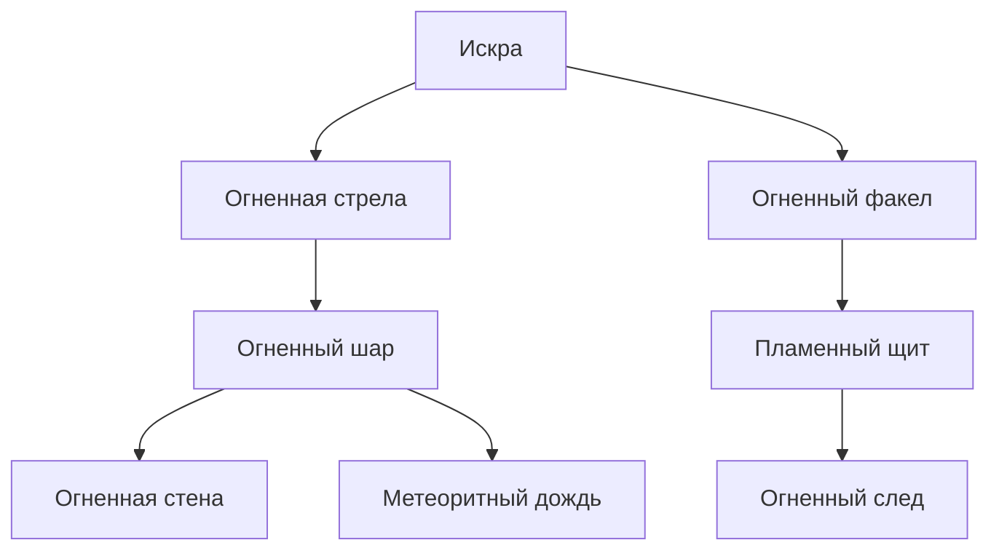
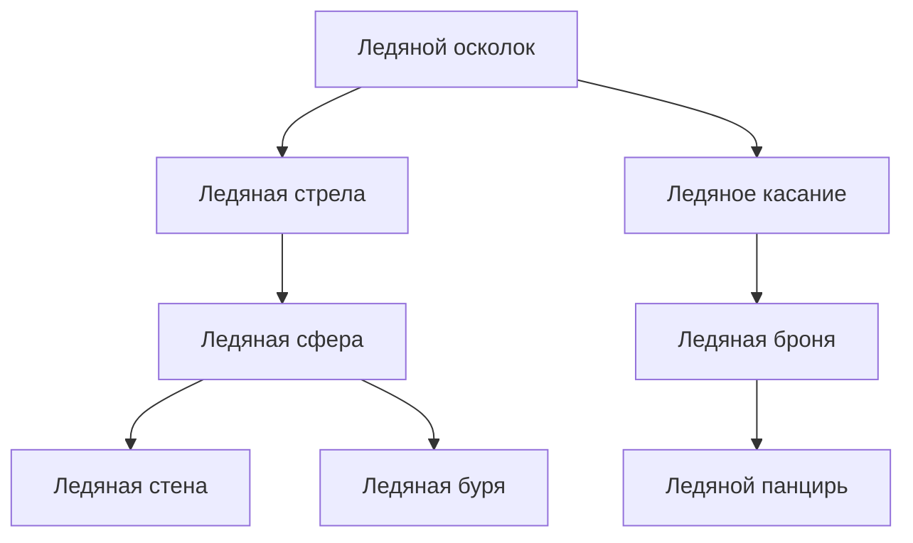
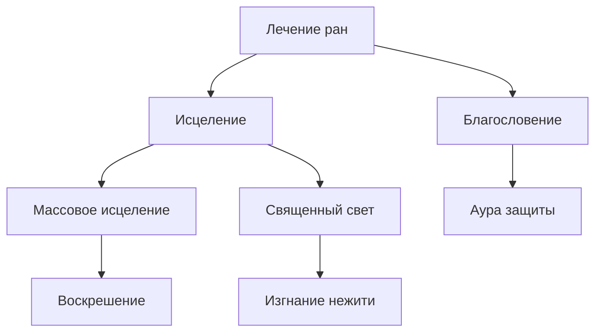
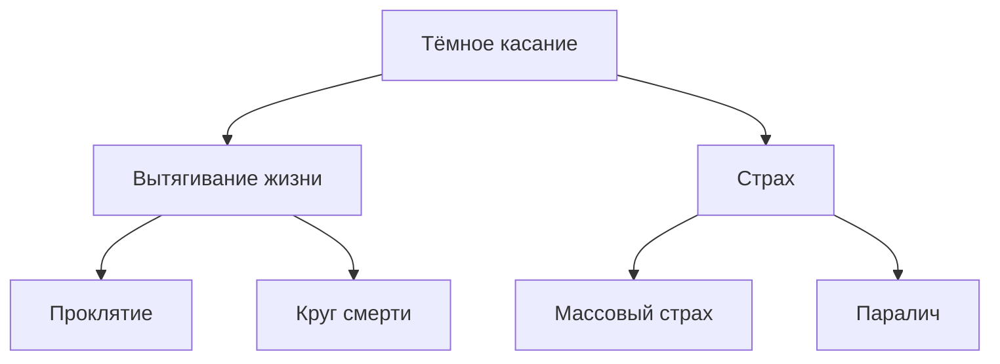
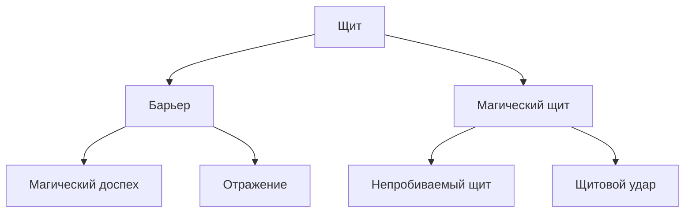
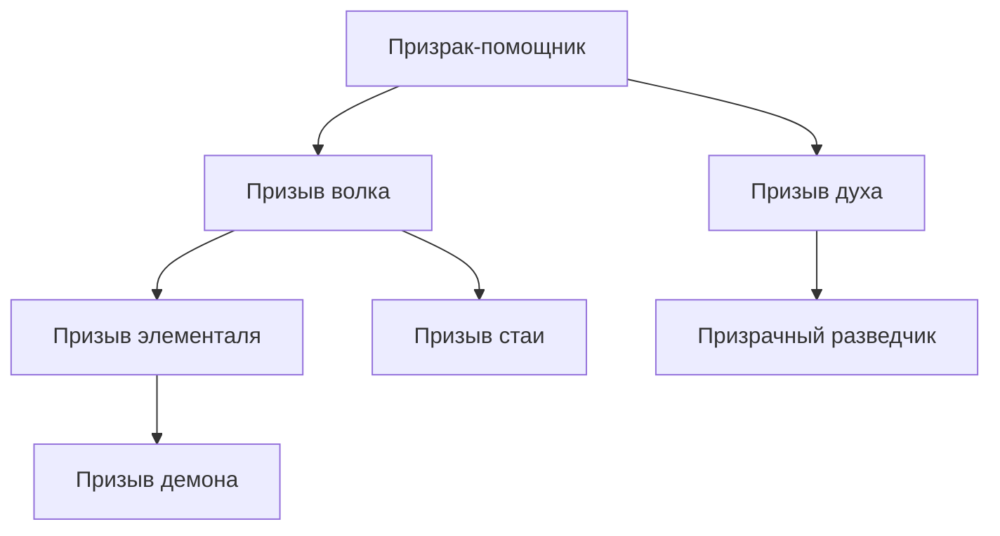
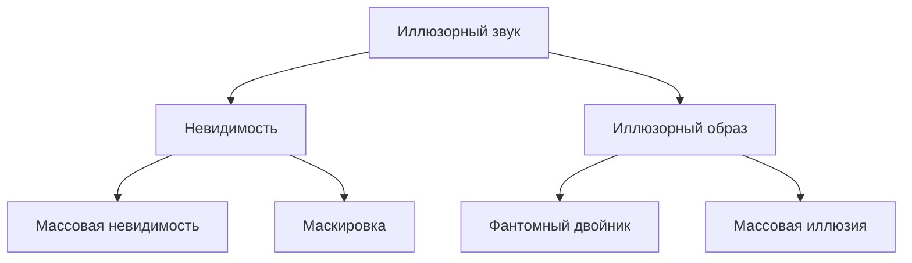
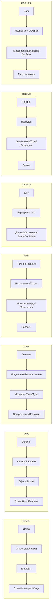

# Система магии

Заклинания изучаются **по древовидной структуре** — чтобы выучить заклинание, нужно знать хотя бы одно из родительских в цепочке. Ветвление позволяет выбирать специализацию внутри школы.

---

## Очки маны (ОМ)

**Базовое ОМ:** `ДУХ × 2 + уровень × 3`

Восстановление: все ОМ за длительный отдых, половина за короткий.

---

## Изучение заклинаний

- При повышении уровня — **1 новое заклинание** (если есть доступ к магии)
- **Корневое** заклинание ветки изучается без требований
- Для изучения следующего — нужно знать **все родительские** (соединённые стрелкой выше)
- Некоторые заклинания требуют **уровень персонажа** (см. таблицы)

---

## Ветки заклинаний

### Огненная магия

| Заклинание | ОМ | Уровень | Требование | Описание |
|------------|-----|---------|------------|----------|
| Искра | 1 | 1 | — | 1d4 урона огнём, дистанция 10 м |
| Огненная стрела | 2 | 1 | Искра | 2d6 урона, дистанция 20 м |
| Огненный факел | 1 | 1 | Искра | Свет 10 м, поджигает горючее |
| Огненный шар | 4 | 3 | Огненная стрела | 4d6 урона по области 3 м |
| Пламенный щит | 3 | 2 | Огненный факел | Сопротивление огню 3, урон при касании 1d4 |
| Огненная стена | 6 | 5 | Огненный шар | Стена 6 м, 4d6 урона при прохождении |
| Метеоритный дождь | 8 | 7 | Огненный шар | 6d6 урона по области 6 м, несколько целей |
| Огненный след | 4 | 3 | Пламенный щит | Линия огня 6 м, 2d6 урона при прохождении |

### Ледяная магия

| Заклинание | ОМ | Уровень | Требование | Описание |
|------------|-----|---------|------------|----------|
| Ледяной осколок | 1 | 1 | — | 1d4 урона холодом, дистанция 10 м |
| Ледяная стрела | 2 | 1 | Ледяной осколок | 2d6 урона, замедление на 1 раунд |
| Ледяное касание | 1 | 1 | Ледяной осколок | Замедление цели на 1 раунд |
| Ледяная сфера | 4 | 3 | Ледяная стрела | 4d6 урона по области 3 м |
| Ледяная броня | 3 | 2 | Ледяное касание | +2 ЗЩ себе на 3 раунда |
| Ледяная стена | 6 | 5 | Ледяная сфера | Стена 6 м, блокирует проход |
| Ледяная буря | 8 | 7 | Ледяная сфера | 6d6 урона по области 6 м, сильное замедление |
| Ледяной панцирь | 5 | 4 | Ледяная броня | Сопротивление холоду 3, +1 ЗЩ на 5 раундов |

### Светлая магия (исцеление)

| Заклинание | ОМ | Уровень | Требование | Описание |
|------------|-----|---------|------------|----------|
| Лечение ран | 1 | 1 | — | 1d6 + ДУХ восстановления ОЗ |
| Исцеление | 3 | 1 | Лечение ран | 2d8 + ДУХ восстановления ОЗ |
| Благословение | 2 | 1 | Лечение ран | +1 к атакам союзника на 3 раунда |
| Массовое исцеление | 5 | 4 | Исцеление | 2d6 + ДУХ для всех союзников в зоне |
| Священный свет | 4 | 3 | Исцеление | 3d6 урона нежити по области 3 м |
| Аура защиты | 4 | 3 | Благословение | +1 ЗЩ всем союзникам в зоне на 3 раунда |
| Воскрешение | 8 | 6 | Массовое исцеление | Вернуть к жизни (если смерть < 1 минуты) |
| Изгнание нежити | 5 | 4 | Священный свет | Отогнать нежить (проверка ДУХ) |

### Тёмная магия

| Заклинание | ОМ | Уровень | Требование | Описание |
|------------|-----|---------|------------|----------|
| Тёмное касание | 1 | 1 | — | 1d4 урона тьмой, дистанция касания |
| Вытягивание жизни | 3 | 2 | Тёмное касание | 2d6 урона, половина — в ОЗ |
| Страх | 2 | 1 | Тёмное касание | Цель должна пройти проверку ДУХ или отступить |
| Проклятие | 4 | 4 | Вытягивание жизни | -2 к атакам и проверкам цели |
| Круг смерти | 6 | 6 | Вытягивание жизни | 4d6 урона по области 4 м |
| Массовый страх | 4 | 3 | Страх | Страх по области 3 м |
| Паралич | 5 | 4 | Страх | Одна цель: проверка ДУХ или пропуск хода |

### Магия защиты

| Заклинание | ОМ | Уровень | Требование | Описание |
|------------|-----|---------|------------|----------|
| Щит | 1 | 1 | — | +4 ЗЩ до следующего хода |
| Барьер | 3 | 2 | Щит | +2 ЗЩ союзнику на 3 раунда |
| Магический щит | 2 | 1 | Щит | +2 ЗЩ себе на 2 раунда |
| Магический доспех | 4 | 4 | Барьер | +4 ЗЩ цели на 10 минут |
| Отражение | 4 | 3 | Барьер | Следующая атака по цели отражается на атакующего |
| Непробиваемый щит | 6 | 6 | Магический щит | Иммунитет к урону 1 раунд |
| Щитовой удар | 5 | 4 | Магический щит | При блоке — 1d6 урона атакующему |

### Магия призыва

| Заклинание | ОМ | Уровень | Требование | Описание |
|------------|-----|---------|------------|----------|
| Призрак-помощник | 2 | 1 | — | Дух выполняет 1 простое действие |
| Призыв волка | 4 | 3 | Призрак-помощник | Волк сражается 3 раунда |
| Призыв духа | 3 | 2 | Призрак-помощник | Дух разведки, передаёт информацию |
| Призыв элементаля | 6 | 5 | Призыв волка | Элементаль сражается 5 раундов |
| Призыв стаи | 5 | 4 | Призыв волка | 3 волка на 2 раунда |
| Призыв демона | 8 | 7 | Призыв элементаля | Мощное существо, 3 раунда |
| Призрачный разведчик | 4 | 3 | Призыв духа | Невидимый разведчик на 10 минут |

### Магия иллюзий

| Заклинание | ОМ | Уровень | Требование | Описание |
|------------|-----|---------|------------|----------|
| Иллюзорный звук | 1 | 1 | — | Создать звук |
| Невидимость | 3 | 2 | Иллюзорный звук | Скрыть 1 цель на 3 раунда |
| Иллюзорный образ | 2 | 1 | Иллюзорный звук | Статичный образ (обман зрения) |
| Массовая невидимость | 5 | 4 | Невидимость | Скрыть группу на 2 раунда |
| Маскировка | 6 | 5 | Невидимость | Принять облик другого существа |
| Фантомный двойник | 4 | 3 | Иллюзорный образ | Копия отвлекает, 50% шанс переключить атаку |
| Массовая иллюзия | 6 | 5 | Иллюзорный образ | Иллюзия группы существ |

---

## Концентрация

Некоторые заклинания требуют концентрации — заклинатель не может поддерживать более одного такого заклинания. При получении урона — проверка ДУХ (СЛ = половина полученного урона).

---

## Ритуалы

Заклинания, не требующие ОМ, но занимающие время (10+ минут). Примеры: Определение магии, Очищение воды, Защита от зла.

---

## Диаграммы деревьев заклинаний

### Огненная магия

### Ледяная магия

### Светлая магия

### Тёмная магия

### Магия защиты

### Магия призыва

### Магия иллюзий

### Сводная диаграмма всех школ

