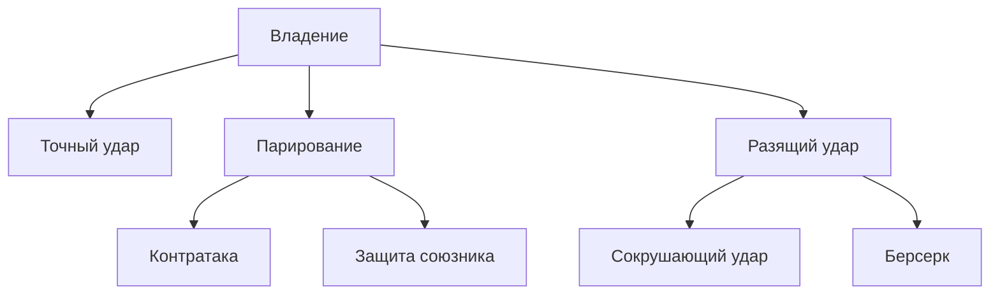
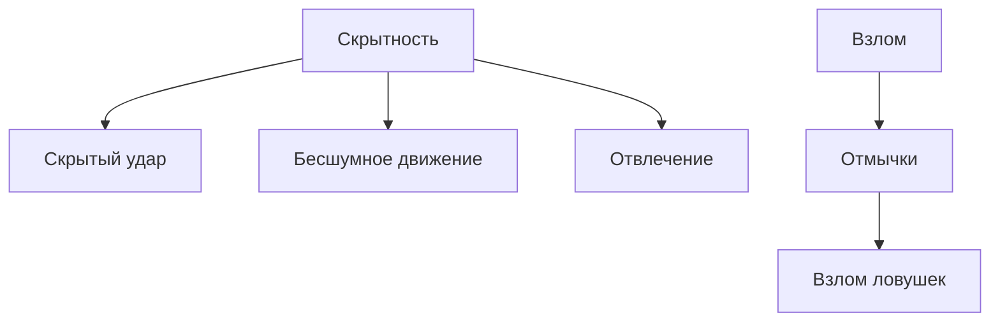
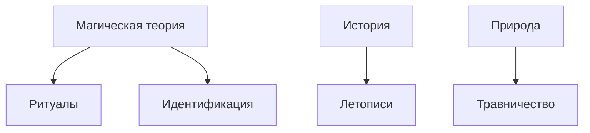
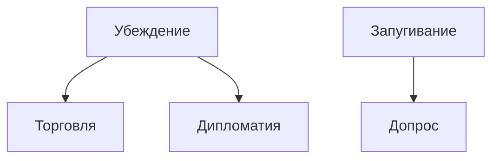
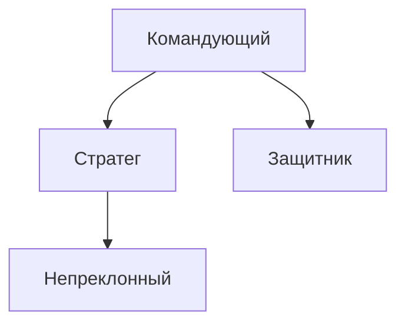
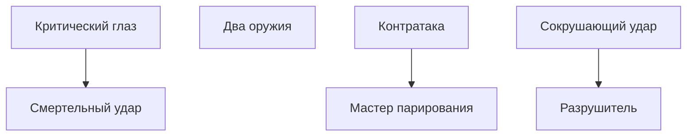
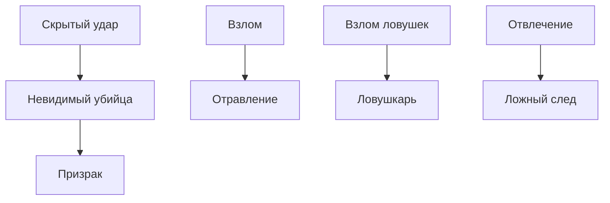
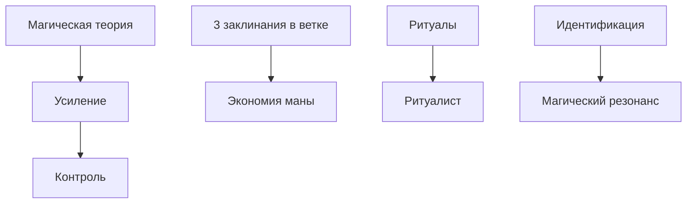
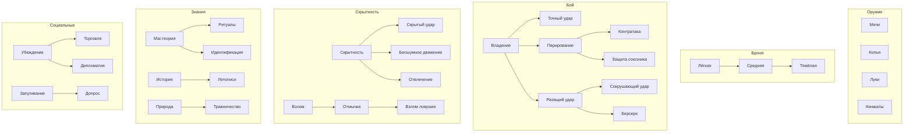

# Навыки и таланты

Навыки и таланты изучаются **по древовидной структуре** — для освоения нужны родительские умения. Ветвление позволяет выбирать специализацию.

---

## Очки развития

При повышении уровня персонаж получает:
- **2 очка навыков** — для изучения новых навыков
- **1 очко таланта** — для талантов (каждые 2 уровня)

---

## Навыки

Навыки дают **бонус к проверкам** (+2 за каждый ранг) и иногда **пассивные способности**.

### Владение оружием (корневые — без требований)

| Навык | Требование | Эффект |
|-------|------------|--------|
| Мечи и топоры | — | +2 к атаке мечами и топорами |
| Копья и древковое | — | +2 к атаке копьями |
| Луки и арбалеты | — | +2 к атаке дальним оружием |
| Кинжалы и лёгкое | — | +2 к атаке кинжалами, можно скрытый удар |

### Броня

| Навык | Требование | Эффект |
|-------|------------|--------|
| Лёгкая броня | — | Нет штрафа в лёгкой броне |
| Средняя броня | Лёгкая броня | Нет штрафа в средней броне |
| Тяжёлая броня | Средняя броня | Нет штрафа в тяжёлой броне |

### Боевые приёмы

| Навык | Требование | Эффект |
|-------|------------|--------|
| Точный удар | Владение (любое) | +1d6 урона при критическом ударе |
| Парирование | Владение (мечи/топоры) | Бонусное действие: +2 ЗЩ до следующего хода |
| Разящий удар | Владение (любое) | Трата 1 ОВ: +2 к попаданию и урону |
| Контратака | Парирование | При парировании — ответная атака |
| Защита союзника | Парирование | Можешь принять атаку на союзника в зоне касания |
| Сокрушающий удар | Разящий удар | Разящий удар сбивает с ног при успехе |
| Берсерк | Разящий удар | Разящий удар даёт +1 ОВ при убийстве |

### Скрытность и обман

| Навык | Требование | Эффект |
|-------|------------|--------|
| Скрытность | — | +2 к проверкам скрытности |
| Взлом | — | +2 к проверкам взлома |
| Скрытый удар | Скрытность | +2d6 урона при атаке незамеченной цели |
| Отмычки | Взлом | Преимущество на взлом замков |
| Бесшумное движение | Скрытность | Игнорировать штраф за скрытность при движении |
| Взлом ловушек | Отмычки | +2 к обнаружению и обезвреживанию ловушек |
| Отвлечение | Скрытность | Бонусное действие: отвлечь врага для союзника |

### Знания

| Навык | Требование | Эффект |
|-------|------------|--------|
| Магическая теория | — | +2 к проверкам знания магии |
| История | — | +2 к проверкам знания истории |
| Природа | — | +2 к проверкам знания природы |
| Ритуалы | Магическая теория | Может выполнять ритуалы |
| Идентификация | Магическая теория | Определение магических предметов |
| Летописи | История | +2 к поиску информации в архивах |
| Травничество | Природа | Создание зелий и антидотов |

### Социальные

| Навык | Требование | Эффект |
|-------|------------|--------|
| Убеждение | — | +2 к проверкам убеждения |
| Запугивание | — | +2 к проверкам запугивания |
| Обман | — | +2 к проверкам обмана |
| Торговля | Убеждение | +2 к торгу |
| Дипломатия | Убеждение | Преимущество при переговорах |
| Допрос | Запугивание | +2 к выбиванию информации |

---

## Таланты

Таланты — **мощные способности**, требующие цепочки навыков. Ветвление позволяет выбирать путь развития.

### Тактика

| Талант | Требование | Эффект |
|--------|------------|--------|
| Командующий | Владение + Броня | Бонусное действие: союзник в зоне получает +1 к следующей атаке |
| Стратег | Командующий | Раз в бой: переставить инициативу двух союзников |
| Непреклонный | Стратег | Союзники в зоне получают сопротивление урону 1 |
| Защитник | Командующий + Защита союзника | Можешь реакцией принять атаку на союзника в зоне |

### Мастер клинка

| Талант | Требование | Эффект |
|--------|------------|--------|
| Критический глаз | Точный удар | Критический удар на 19-20 |
| Два оружия | Владение (кинжалы) | Бонусная атака вторым оружием (-2 к обеим) |
| Смертельный удар | Критический глаз + Разящий удар | При крите — дополнительный бросок урона |
| Мастер парирования | Контратака | Контратака наносит полный урон |
| Разрушитель | Сокрушающий удар | Сокрушающий удар игнорирует половину брони |

### Тень

| Талант | Требование | Эффект |
|--------|------------|--------|
| Невидимый убийца | Скрытый удар | После скрытой атаки остаёшься скрытым при успехе |
| Отравление | Взлом | Может создавать и применять яды |
| Призрак | Невидимый убийца | Можешь двигаться через врагов без провокации атаки |
| Ловушкарь | Взлом ловушек | Может устанавливать ловушки за 1 раунд |
| Ложный след | Отвлечение | Враги с помехой при поиске скрытых союзников |

### Магическое мастерство

| Талант | Требование | Эффект |
|--------|------------|--------|
| Экономия маны | 3 заклинания в одной ветке | -1 ОМ к заклинаниям этой ветки |
| Усиление | Магическая теория | +1 к урону заклинаний |
| Контроль | Усиление | Можешь уменьшить область заклинания для +2 к урону |
| Ритуалист | Ритуалы | Ритуалы занимают в 2 раза меньше времени |
| Магический резонанс | Идентификация | Может усиливать магические предметы |

### Выносливость

| Талант | Требование | Эффект |
|--------|------------|--------|
| Железная воля | Владение + Броня | Преимущество против страха и очарования |
| Неудержимый | Берсерк | Раз в бой: игнорировать состояние «сбит с ног» |
| Живучий | Лёгкая броня | +5 ОЗ |

---

## Максимум рангов

- **Навык:** до 3 рангов (бонус +2, +4, +6)
- **Талант:** 1 ранг (взял — есть)

Для взятия таланта нужны **все указанные навыки** на любом ранге.

---

## Диаграммы деревьев навыков и талантов

### Боевые приёмы

### Скрытность и обман

### Знания

### Социальные

### Дерево талантов — Тактика

### Дерево талантов — Мастер клинка

### Дерево талантов — Тень

### Дерево талантов — Магическое мастерство

### Сводная диаграмма навыков

