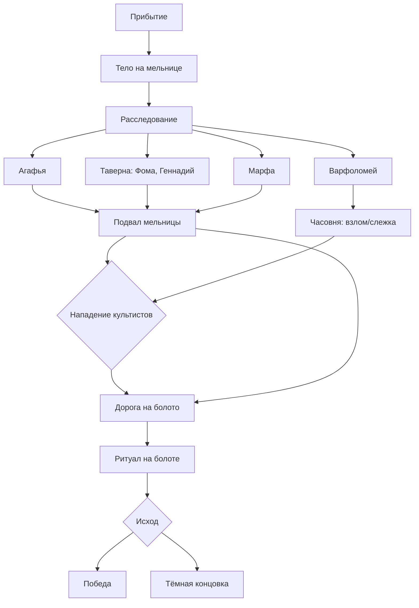
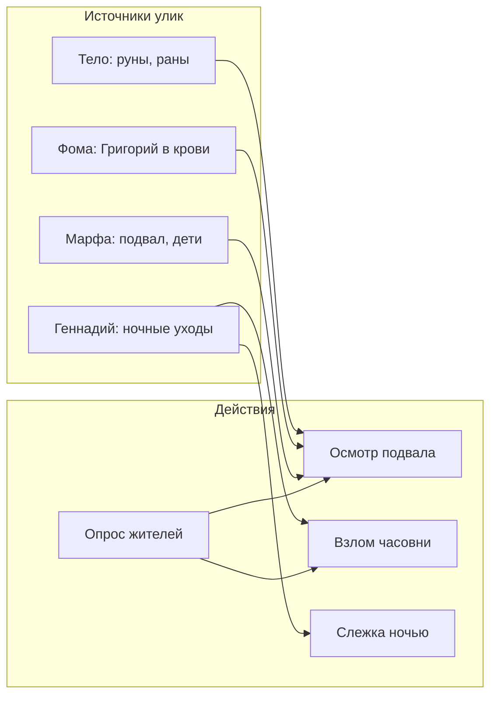
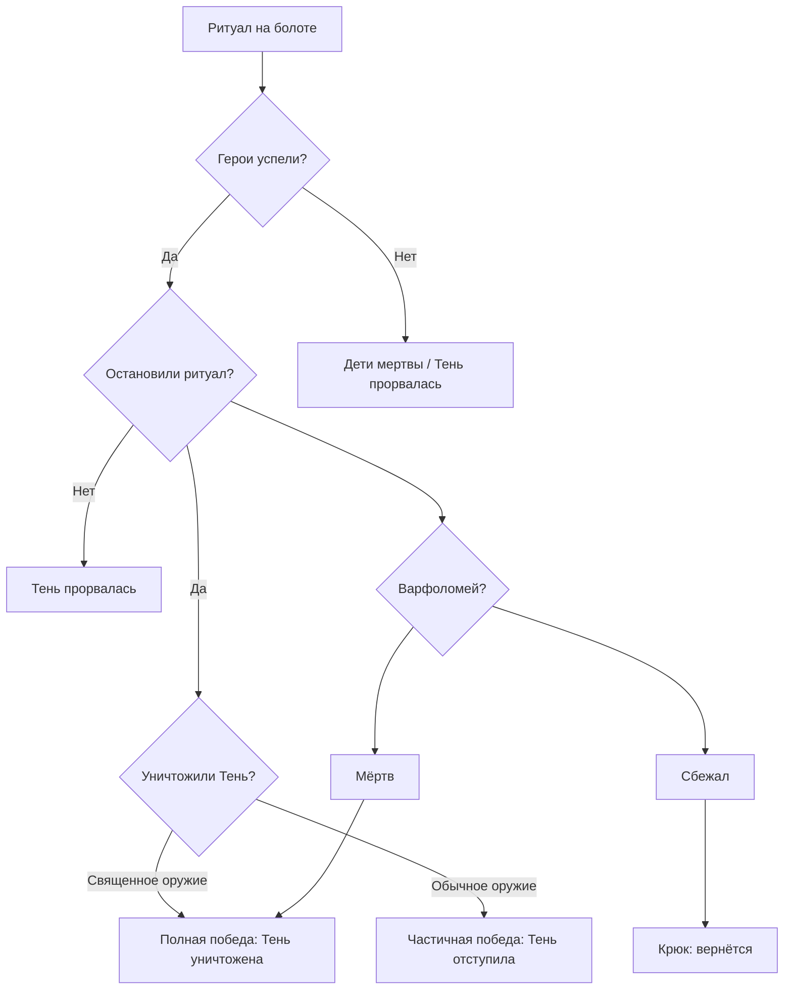
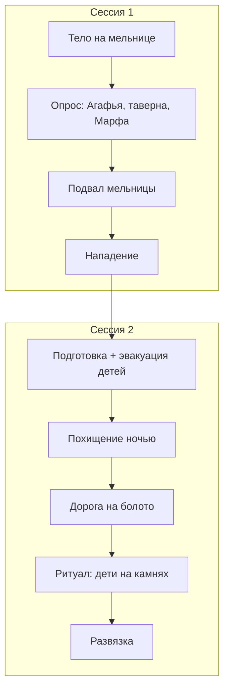

# Приключение: Тень, что жрёт

**Жанр:** Тёмное фэнтези, детектив, мистика  
**Длительность:** 1–2 сессии (6–10 часов)  
**Уровень:** 1–3  
**Система:** EZY-system (или совместимая)

**Предупреждение:** Содержит описания жестокости и ритуального насилия. Рекомендуется обсудить границы с игроками.

---

## Содержание

1. [Аннотация и завязка](#аннотация)
2. [Дерево сюжета](#дерево-сюжета)
3. [Деревня Чёрный Брод](#деревня-чёрный-брод)
4. [Карта и локации](#карта-и-локации) (включая карты для сцен)
5. [Священное оружие](#священное-оружие)
6. [НПЦ: портреты и диалоги](#нпц-портреты-и-диалоги)
7. [Сцены сессии 1](#сессия-1-прибытие-и-расследование)
8. [Сцены сессии 2](#сессия-2-болото-и-развязка)
9. [Варианты развития и ветвления](#варианты-развития)
10. [Бестиарий](#бестиарий)

---

## Аннотация

В деревне Чёрный Брод люди исчезают. Тех, кого находят, обнаруживают изувеченными — с вырезанными символами, без глаз и внутренностей. Жители шепчут о «Тени», что приходит по ночам. Героям предстоит раскрыть культ кровавых жрецов, поклоняющихся сущности из-за Завесы, и остановить ритуал, который откроет врата в иной мир.

---

## Дерево сюжета

### Общая схема приключения



### Ветвление расследования



### Дерево концовок



### Последовательность сцен (таймлайн)



---

## Завязка: варианты появления героев

### Вариант А: По приглашению Агафьи
Герои получили письмо или посыльного от знахарки. «Приезжайте. Здесь творят нечто ужасное. Я боюсь назвать это».

### Вариант Б: Проездом
Герои едут через Чёрный Брод. На въезде — толпа, крики. Кто-то машет руками, зовёт.

### Вариант В: Задание
Герои наняты властями или гильдией расследовать исчезновения в округе.

---

## Сцена прибытия: тело на мельнице

**Описание для мастера:** Толпа человек двадцать. Молчание. Все смотрят на мельницу. На жерновах — мужчина. Рубаха разорвана. Глаза — пустые впадины. На груди и животе — руны, вырезанные ножом. Внутренности извлечены и разложены вокруг. Запах — кровь, ладан, гниль. Мухи.

**Если герои спрашивают, кто это:**
- «Кузнец Прокоп. Добрый был. Вчера вечером ещё видели».
- «Третий за месяц. Господи, третий…»

**Агафья** (пожилая, в тёмном платке, трясущиеся руки) подходит первой:

> «Вы те, кого я звала? Нет? Неважно. Смотрите. Смотрите на него. Первого нашли в колодце — старик Сидор. Вторую — пастушку Марину — в лесу у сторожки. Все так же. Эти знаки. Глаза… Внутренности… Люди говорят — Тень. Я не знаю, что это. Но я видела. У часовни. Холод такой, что зубы стучали. И шёпот. Как будто кто-то звал по имени. Умоляю вас. Найдите, кто это творит. Пока не стало поздно».

**Варианты ответа героев:**

| Ответ | Реакция Агафьи |
|-------|----------------|
| Согласие помочь | «Спасибо. Спасибо. Идите ко мне. Я расскажу всё, что знаю. И дам… кое-что. На случай, если встретите Эту». |
| Вопрос о награде | «У меня есть тридцать монет. Всё, что скопила. И оберег. Древний. Может, поможет». |
| Отказ | «Тогда уезжайте. Пока можете. И не возвращайтесь. Здесь скоро не останется никого». |
| Вопрос о властях | «Писали. Дважды. Никто не приехал. Нам сказали — разбирайтесь сами. Мы — деревня. Нам не до нас». |

**Осмотр тела:** Проверка Знания (Магическая теория) или Природа СЛ 12 — руны означают призыв, «открытие двери». СЛ 16 — можно зарисовать и позже расшифровать полностью. При касании рун (если герой решится) — видение: вспышка холода, болото, туман, три фигуры в капюшонах, крик. Проверка ВОЛЯ СЛ 10 или −1 к проверкам на 1 час.

---

## Деревня Чёрный Брод

Заброшенная деревня у болотистой реки Чёрная. Около 60 жителей. Половина домов пуста — люди уехали. Остались старики, бедняки и те, кто не может уйти.

**Атмосфера:** Тишина. Занавески задёрнуты. Собаки не лают. Дети не играют на улице. Везде чувствуется страх.

---

## Карта и локации


### Карты для сцен (битвы и ключевые локации)

| Сцена | Описание |
|-------|----------|
| Тело на мельнице | Осмотр тела, поиск люка в подвал |
| Подвал мельницы | Бой с Григорием или культистами, алтарь |
| Часовня | Взлом, осмотр алтаря, возможный бой |
| Нападение | Григорий + Степан из засады на дороге |
| Лесная сторожка | Следы ритуала с Мариной, расследование |
| Ритуал на болоте | Главная битва с Варфоломеем и Тенью |


*Интерьер мельницы — сцена 1: тело на мельнице*


*Подвал мельницы — сцена 3: бой в тесноте*


*Часовня — взлом, алтарь культа*


*Засада — сцена 4: нападение культистов*


*Лесная сторожка — следы ритуала с Мариной*


*Болото — главная битва, ритуал «Великое открытие»*

---

```
        [ЛЕС]
           |
    [Сторожка]----[Болото]
           |          |
    ======[ДЕРЕВНЯ]======
    |    |    |    |    |
 [Мельница] [Часовня] [Таверна]
    |    |    |    |    |
 [Подвал] [Дом жреца] [Дома]
```

### Мельница
Заброшена после смерти мельника Боровика. Колесо сломано. Внутри — жернова, лестница на второй этаж, мешки с прогнившим зерном. **Люк в подвал** — под мешками, Скрытность СЛ 14 чтобы заметить. Или Марфа может подсказать.

### Подвал мельницы
Каменные стены, сырость. В глубине — алтарь из тёмного камня. Руны. Выемки для крови. Кости в углу. Запах — кровь, ладан. При спуске — проверка ВОЛЯ СЛ 12, иначе желание уйти. На алтаре — записи Варфоломея (см. Ключи).

### Часовня
Небольшая каменная постройка. Дверь на замке. Варфоломей говорит, что «охраняет от скверны». Ночью — свет в окнах. Внутри (при взломе) — алтарь, банки с трофеями, окровавленные ножи, книга ритуалов.

### Дом жреца Варфоломея
Каменный, самый крепкий в деревне. Рядом с часовней. В подполье — клетка с пленниками (1–2 человека для ритуала). Охраняет Григорий или Степан, если они не в другом месте.

### Таверна «Тихая вода»
Единственное место, где собираются. Хозяин Геннадий. Полупустая. Фома — пьяница — обычно здесь.

### Болото
К северу, 2 часа ходьбы. Трясина, туман. «Место силы» — Завеса тонка. Там проводят главный ритуал.

### Лесная сторожка
Где нашли пастушку Марину. Обугленная земля, следы ритуала. Можно найти обрывок ткани с символом Тени.

---

## Священное оружие

Герои могут получить **Серебряный кинжал света** — единственное оружие, способное уничтожить Жрущую Тень навсегда, а не только отогнать её в Завесу.

### Как получить

**Источник:** Агафья. У её бабки был кинжал, благословлённый странствующим священником. «Против нечисти», говорила она. Агафья хранила его годами.

**Условия (минимум одно):**
- Герои спросили: «Что может уничтожить Тень?» или «Есть ли священное оружие?» — см. диалог Агафьи
- Герои перед походом на болото говорят с Агафьей и берут оберег — она даёт и кинжал
- Герои спасли детей или нашли убедительные улики — Агафья доверяет и даёт кинжал

### Свойства кинжала

| Параметр | Значение |
|----------|----------|
| **Урон** | 1d6 |
| **Тип** | Серебро, ближний бой |
| **СКА** | 3 |
| **По Жрущей Тени и призванным существам культа** | ×2 урона |
| **Смертельный удар по Жрущей Тени** | Тень уничтожена навсегда (не отступает в Завесу) |
| **По нежити** | ×1.5 урона (как серебро) |

*Кинжал не магический — просто благословлён. После уничтожения Тени может остаться у героев или потерять силу (на усмотрение мастера).*

---

## НПЦ: портреты и диалоги

### Агафья, знахарка
**Внешность:** 60 лет, седая, тёмный платок, морщины, умные глаза.  
**Характер:** Умная, напуганная, но решительная. Единственная, кто осмелился действовать.

**Как подойти:** Подходит первой у тела. Зовёт к себе — «не на улице». Доверяет тем, кто согласился помочь.

**Диалоги при опросе:**

*При первой встрече (после завязки):*
> «Пойдёмте ко мне. Не на улице говорить».

*В доме (основной рассказ):*
> «Я живу здесь сорок лет. Видела всякое. Но это… это не от мира сего. Старик Сидор — нашли в колодце. Марина — в лесу. Теперь Прокоп. Все с этими знаками. Жрец Варфоломей говорит — молитвы читает, от скверны охраняет. Но я видела. У часовни. Ночью. Холод. И шёпот. Как будто меня звали. Я убежала. Больше не хожу туда».

*Если спросить про Варфоломея:*
> «Он пришёл лет десять назад. Сказал — служитель. Часовню построили, он в ней живёт. Люди уважают. Но я… я чувствую. От него — холод. Не телесный. Душевный. И мясник Григорий — его друг. Степан, что палачом был — тоже. Трое они. Всегда вместе».

*Если спросить про других:*
> «Марфа — вдова мельника. Муж её Боровик полез в подвал мельницы, что-то искал. Не вернулся. Тело не нашли. Дети у неё — трое, малые. Она боится. Фома — пьяница. Но он что-то видел. Боится говорить. Дам вам оберег. Древний. От бабки остался. Может, поможет, если встретите… Эту».

*Если спросить «Кто в опасности? Кого они ещё хотят?»:*
> «Не знаю наверняка. Но… Марфа. Её дети. Я чувствую. Жрец смотрел на них. Так смотрел. Спросите Марфу. Или ищите в подвале мельницы — там, где Боровик пропал. Там ответы».

*Если герои согласились помочь:*
> «Тридцать монет — ваши. И оберег. Спасите нас. Или хотя бы детей. Детей спасите».

*Если спросят, как уничтожить Тень или есть ли священное оружие:*
> «Уничтожить? Обычным железом — нет. Она отступит. Вернётся. Но… у моей бабки был клинок. Серебряный. Священник его благословил. Говорила — против нечисти из тьмы. Того, что за Завесой. Он у меня. Я боялась его показывать. Но… возьмите. Один удар им — и Тень не вернётся. Навсегда».

*Перед походом на болото (если доверяет героям):*
> «Вот оберег. И… ещё кое-что. Кинжал бабкин. Серебряный. Возьмите. Если встретите Её — только им можно».

*Если спросить «С чего начать расследование?»:*
> «Поговорите с Фомой. Он пьяница, но видел. И с Геннадием — трактирщик. Он знает, куда они ходят по ночам. Марфа — про подвал. Там что-то есть. Я уверена».

---

### Фома, пьяница
**Внешность:** 50 лет, седой, красное лицо, дрожащие руки.  
**Характер:** Трусливый, но не злой. Знает больше, чем говорит. Боится Варфоломея и его людей.

**Как подойти:** Сидит в таверне, пьёт. Не любит, когда к нему пристают. Лучше подсесть, купить кружку, говорить тихо.

**Диалоги при опросе:**

*Первая встреча (без подкупа/проверки):*
> «Чего пристали? Не знаю я ничего. Отстаньте».
> *(Если настаивают:)* «Идите к Агафье. Она всё знает. Меня не трогайте».

*Убеждение СЛ 12 или 3 монеты (начало разговора):*
> «Ладно. Ладно. Только тихо. В ту ночь — когда Прокопа убили — я шёл. Мимо мясной. Григорий вышел. Фартук — в крови. По локоть. Говорю: что, скотину резал? Он улыбнулся. Так улыбнулся. Сказал: да, скотину. Но скотину у нас давно не режут. Всех съели или продали. Я ничего не сказал. Побоялся».

*Запугивание СЛ 10:*
> «Не трогайте! Скажу! Григорий — мясник. В ту ночь он был в крови. Сказал — скотину. Но скотины нет! И Степан — с ним всегда. Тот, что глаза собирает. Я слышал. В часовне. Крики. По ночам. Больше не знаю!»

*Обман (под видом властей) СЛ 14:*
> «Власти? Наконец-то! Слушайте. Жрец Варфоломей — он главный. Григорий и Степан — с ним. Они в часовне по ночам. Я слышал. И видел — свет, тени. Что-то делают. Людей. С людьми что-то делают».

*Если спросить «Что именно слышал в часовне?» (после того как рассказал про Григория):*
> «Крики. Плач. Иногда — пение. На чужом языке. И… разговоры. Варфоломей что-то читал. Григорий смеялся. Я не подходил близко. Окно было приоткрыто».

*Если спросить «Кого ещё могут взять? Кого ищут?» — Убеждение СЛ 14 или 5 монет + выпивка:*
> «Э… не знаю, о чём вы. Хотя… однажды слышал. Варфоломей говорил — „трое чистых“. И „дети мельника“. „Последние“, сказал. Я не понял. Может, бред. Может, нет. Марфа — вдова мельника. У неё трое. Маленькие. Я… я не хочу в это лезть. Вы меня не слышали».

*Если спросить про болото:*
> «Болото? К северу. Геннадий видел — они туда ходят. Ночью. Возвращаются грязные. Я не ходил. Там… плохо. Холодно. Люди теряются».

*Если спросить «Почему молчишь? Боишься?»:*
> «Боюсь? Да я… они убьют. Как Прокопа. Как Сидора. Вы не видели, что с ними сделали. Я видел. Глаза. Внутренности. Нет. Нет. Я ничего не знаю».

---

### Марфа, вдова мельника
**Внешность:** 35 лет, уставшая, в поношенном платье. Трое детей — 4, 6 и 9 лет.  
**Характер:** Напугана, но пытается держаться. Боится за детей.

**Как подойти:** Живёт в доме у мельницы. Дети обычно рядом. Рада любому, кто готов слушать.

**Диалоги при опросе:**

*При встрече:*
> «Вы те, кто расследует? Спасибо. Спасибо, что приехали. Мой Боровик… он полез в подвал. Под мельницей. Старый подвал. Говорил — что-то там нашёл. Странное. Камни с письменами. Не вернулся. Тело не нашли. Только… кровь. На лестнице. Я не спускалась. Не смогла».

*Если спросить про детей:*
> «Трое у меня. Маленькие — четыре года, шесть, девять. Боятся. Не спят по ночам. Говорят — кто-то смотрит в окно. Я запираюсь. Но что я могу? Одна. Жрец говорит — молиться. Молиться. А от молитв его ещё страшнее становится».

*Если спросить «Варфоломей интересовался детьми?»:*
> «Как… как вы знаете? Он… смотрел на них. На исповеди спрашивал — видели ли они смерть. Знают ли, что такое кровь. Странные вопросы. Я увела их. Больше не ходим в часовню».

*Если спросить «Кого ещё могут похитить?» или предупредить об опасности:*
> «Дети? Они хотят детей? Нет. Нет! Возьмите их. Уведите. Куда угодно. Только не здесь. Я всё отдам. Всё, что есть. Десять монет. Еду. Всё. Спасите их».

*Если спросить про подвал (где люк):*
> «Под мешками. С зерном. Боровик говорил — там старые камни. Руны. Он хотел показать жрецу. Потом… не вернулся».

*Если герои уже были в подвале и спрашивают про записи:*
> «Записи? Не знаю. Боровик что-то читал. Говорил — „не для наших глаз“. Потом пропал».

---

### Геннадий, трактирщик
**Внешность:** 45 лет, полный, лысый, усталый.  
**Характер:** Нейтрален. Не хочет ввязываться. Но знает кое-что. Говорит, если не чувствует угрозы.

**Как подойти:** В таверне, за стойкой. Можно заказать еду — станет разговорчивее. Не любит, когда давят.

**Диалоги при опросе:**

*При встрече:*
> «Таверна открыта. Есть есть, пить есть. Комнаты — есть. Только тихо. В деревне сейчас… не до веселья».

*Если спросить про исчезновения:*
> «Трое за месяц. Сидор, Марина, Прокоп. Все — с этими знаками. Жрец говорит — Тень. Нечисть. Молиться надо. Люди молятся. Не помогает».

*Если спросить про Варфоломея:*
> «Он… странный. Пришёл лет десять назад. Часовню построили. Люди к нему ходят. Но по ночам — он в лесу. Или у болота. Григорий с ним. Степан. Я видел — уходили. Возвращались под утро. Грязные. Усталые. Что делали — не знаю. Не спрашивал».

*Если спросить «Куда именно ходят?»:*
> «К северу. Тропа на болото. Туман там. Холод. Люди теряются. Я не ходил. И не пойду».

*Если спросить «Фома что-то знает?»:*
> «Фома? Пьяница. Но да — он тут частенько. И по ночам шатается. Говорит, что не спит. Может, видел что. Спросите. Только не пугайте — он и так трясётся».

*Если спросить про Марфу и детей:*
> «Марфа — вдова. Трое детей. Живут у мельницы. Жалко их. После Боровика — одной тяжело. Жрец к ним заходил. Навещал, говорил. Странно как-то. Она потом перестала пускать».

*Если настаивают на подробностях (Убеждение СЛ 11):*
> «Ладно. Однажды слышал — Варфоломей говорил Григорию: „Скоро. Третья луна. Подготовь всё“. Григорий улыбнулся. Сказал: „Уже присмотрел“. Больше не знаю».

---

### Варфоломей, жрец культа
**Внешность:** 50 лет, седые волосы, пустые глаза, спокойное лицо. Одежда — тёмная ряса.  
**Характер:** Убеждён в своей правоте. Спокоен. Не кричит. Говорит тихо, даже когда угрожает.

**Диалоги:**

*При первой встрече (у часовни):*
> «Странники. Добро пожаловать в Чёрный Брод. Я — Варфоломей. Служитель. Вы, верно, о несчастьях слышали. Молюсь за души погибших. Часовня — святое место. Охраняю от скверны. Входить никому не дозволяю. Скверна не должна проникнуть».

*Если просят впустить:*
> «Нет. Не могу. Здесь — святыни. Обряды. Не для посторонних глаз. Поверьте мне. Я знаю, что делаю».

*Если обвиняют:*
> «Вы ошибаетесь. Я — служитель. Очищаю. Она голодна. Мир полон скверны. Кровь — очищение. Ты не понимаешь. Ты не видишь. Она покажет. Она возьмёт».

*В бою (тихо):*
> «Ты лишь ещё одна жертва. Она примет тебя. С благодарностью».

*При смерти (если не убит сразу):*
> «Она… придёт… без меня. Вы… ничего не… остановите…»

---

### Григорий, мясник
**Внешность:** 40 лет, толстый, жирные руки, всегда улыбается. Фартук — часто в пятнах.  
**Характер:** Садист. Наслаждается «работой». Говорит о резке с удовольствием.

**Диалоги:**

*При встрече (в деревне, днём):*
> «Мясник я. Григорий. Чего надо? Мяса? Скотины нет — всё съели. Но я могу… найти. Для особых гостей». (улыбается)

*В бою:*
> «О, ты хочешь поиграть? Я люблю, когда они дерутся. Дольше живут. Больше кричат».

*При добивании жертвы:*
> «Тихо. Тихо. Скоро всё кончится. А этот пальчик — мой. На память».

---

### Степан, бывший палач
**Внешность:** 45 лет, худой, длинные пальцы, мёртвый взгляд.  
**Характер:** Наслаждается страхом жертвы. Смотрит в глаза до конца. Шепчет что-то перед смертью.

**Диалоги:**

*При встрече:*
> «…» (молчит, смотрит)

*Если настаивают:*
> «Степан. Раньше — палач. Теперь — служитель. Чего надо?»

*В бою:*
> «Смотри на меня. Смотри. Я хочу видеть. В последний момент. Что там. В глазах».

*Шепот жертве (если игроки слышат):*
> «Скоро ты увидишь. Что мы видим. Она прекрасна. Ты станешь частью. Частью Её».

---

## Ключи и улики (справочник для мастера)

| Источник | Улика | К чему ведёт |
|----------|-------|--------------|
| Тело Прокопа | Руны, характер ран, ладан | Культ, ритуал |
| Фома | Григорий в крови, «скотины нет» | Мясник причастен |
| Фома (доп.) | «Трое чистых», «дети мельника» (СЛ 14 или 5 монет) | Дети — цель ритуала |
| Марфа | Боровик в подвале, кровь, люк под мешками | Подвал мельницы |
| Марфа (доп.) | Варфоломей спрашивал про детей | Подтверждение угрозы |
| Геннадий | Варфоломей уходит ночью в лес/болото | Жрец причастен |
| Подвал мельницы | Алтарь, кости, записи | План «Великое открытие», болото, дети Марфы |
| Часовня (взлом) | Алтарь, трофеи, книга ритуалов | «Трое чистых» — требование ритуала |
| Агафья | Холод у часовни, шёпот | Сверхъестественное |
| Агафья (доп.) | «Марфа, дети. Ищите в подвале» | Подсказка к расследованию |

**Записи Варфоломея (подвал):** «Третья луна. Болото. Северная трясина. Трое чистых. Она откроется. Дети мельника — последние. Они не видели. Не знают. Идеальны».

### Откуда герои узнают, что для ритуала нужны дети

| Источник | Условие | Информация |
|----------|---------|------------|
| **Подвал мельницы** | Герои спустились и прочитали записи на алтаре | Прямо: «Дети мельника — последние. Трое чистых. Идеальны» |
| **Фома** | Убеждение СЛ 14 или 5 монет + выпивка; спросить «кого ещё хотят взять?» | Слышал через окно часовни: «…трое чистых… дети мельника… последние» — не понимает до конца |
| **Книга в часовне** | Взлом часовни, осмотр книги ритуалов (Знание СЛ 12) | «Великое открытие требует троих чистых — не видевших смерти, не знающих скверны» |
| **Марфа** | Герои предупреждают об опасности или спрашивают «кого могут похитить?» | «Дети… они говорили про детей. Жрец смотрел на моих. Так смотрел. Я испугалась» (вспоминает) |

*Если герои не получили ни одной улики — мастер может подсказать через Агафью: «Марфа… её дети. Я чувствую. Они в опасности. Спросите её. Или ищите в подвале мельницы».*

---

## Сессия 1: Прибытие и расследование

### Сцена 1: Тело на мельнице (20–25 мин)
*См. [Сцена прибытия](#сцена-прибытия-тело-на-мельнице) выше.*

### Сцена 2: Опрос жителей (30–40 мин)

**Порядок посещений (рекомендуемый):**
1. Агафья — базовая информация, подсказка «кто в опасности»
2. Таверна — Геннадий, Фома
3. Марфа — подвал, дети, люк под мешками
4. Варфоломей — часовня (если герои решат поговорить)

**Рекомендуемые вопросы (для мастера):**

| Свидетель | Ключевые вопросы | К чему ведёт |
|-----------|------------------|--------------|
| Агафья | «Кто в опасности?» | Марфа, дети, подвал |
| Фома | «Что слышал в часовне?» «Кого ещё хотят взять?» | Григорий, «дети мельника», болото |
| Марфа | «Варфоломей интересовался детьми?» «Где люк в подвал?» | Подтверждение угрозы, путь в подвал |
| Геннадий | «Куда ходят по ночам?» «Фома что-то знает?» | Болото, Фома как источник |

**Варианты действий:**
- **Обыскать мельницу** — Скрытность/Внимание СЛ 12: найти люк в подвал
- **Подкупить Фому** — 3 монеты или Убеждение СЛ 12
- **Запугать Фому** — Запугивание СЛ 10
- **Ночью следить за часовней** — Скрытность СЛ 14: увидеть свет, тени, услышать крик

### Сцена 3: Подвал мельницы (20–25 мин)

**Спуск:** Лестница крутая, тёмная. Внизу — холод. Запах крови.

**Осмотр:** Алтарь, кости, руны. Записи Варфоломея (см. Ключи). При чтении — проверка ВОЛЯ СЛ 10 или видение: болото, три фигуры, жертва на камне.

**Возможная встреча:** Если культисты узнали о расследовании — Григорий может быть в подвале (очищает следы). Бой в тесноте.

### Сцена 4: Нападение (20–30 мин)

**Триггеры нападения:**
- Герои побывали в подвале
- Герои слишком открыто расспрашивали
- Герои попытались вломиться в часовню
- Ночью — культисты решают убрать «чужаков»

**Место:** Дорога, окраина деревни, или у дома героев (таверна).

**Противники:** Григорий + Степан. Возможно +1 культист (см. Бестиарий).

**Тактика:** Нападают из засады. Цель — убить. Не берут в плен (кроме особых случаев для ритуала). При смерти одного — второй может сбежать к часовне.

**После боя:** Обыск. Ритуальные ножи, амулеты с символом Тени. У Григория — мешочек с отрубленными пальцами (3 шт.). У Степана — флакон с «сувениром» (глаз).

---

## Сессия 2: Болото и развязка

### Сцена 1: Подготовка (15–20 мин)

**Действия героев:**
- **Предупредить Марфу** — она в панике: «Возьмите их! Уведите! Куда угодно!» Герои могут отвести детей к Агафье (безопасно) или оставить 1 героя охранять дом. Если дети у Агафьи или под охраной — похищение не удаётся.
- Агафья даёт оберег (1 раз игнорировать испуг от Тени)
- Расспросить о болоте — Геннадий или Агафья: «К северу. Тропа есть. Но туман. И холод. Люди теряются. Не все возвращаются»
- Подготовить свет (факелы, заклинание) — против Тени

### Сцена 1.5: Похищение детей

**Когда происходит:** В ночь перед ритуалом (третья луна). Культисты ждут, пока герои спят или отвлечены.

**Условие похищения:** Если герои **не** эвакуировали детей к Агафье или не оставили охрану у дома Марфы — культисты (Григорий + Степан или +1 культист) врываются ночью. Марфа не может противостоять. Дети похищены.

**Если герои защитили детей:** Культисты не успевают. Ритуал на болоте идёт с пленником из клетки (см. Дом жреца) — один «чистый», ритуал слабее, Тень проявляется не полностью. Или культисты пытаются напасть на убежище — короткий бой, дети в безопасности.

**Утро. Марфа (если дети похищены):**
> «Они пришли! Ночью! Григорий… Степан… Вломились. Забрали их. Троих! Моих детей! Куда? Куда они их повели? На болото! Я слышала — „болото“, „третья луна“. Спасите их! Умоляю!»

**Агафья (если дети похищены):**
> «Они успели. Проклятые. Сегодня ночь ритуала. Третья луна. Идите на болото. Северная трясина. Может, ещё не поздно».

### Сцена 2: Дорога на болото (15–20 мин)

**Атмосфера:** Туман сгущается. Холод. Шёпот — кажется, зовут по имени. Проверка ВОЛЯ СЛ 10 — не сбиться с пути. Провал — герой отстаёт на 1d6 минут, идёт по кругу.

**Вариант встречи:** Культисты ведут детей (если похитили) или пленника. 2 культиста + Григорий/Степан. Можно перехватить по дороге — бой, дети могут быть освобождены до ритуала (упрощённый финал).

### Сцена 3: Ритуал на болоте (30–40 мин)

**Описание для мастера:** Круг из чёрных камней. В центре — алтарь из тёмного камня, руны светятся тускло. **Трое детей** привязаны к трём камням по кругу — плачут, зовут маму. Или один пленник (если дети спасены). Варфоломей стоит у алтаря, читает на чужом языке. Григорий и Степан — по краям круга, ножи в руках. Туман стелется по земле. Холод пробирает до костей. Слышен детский плач.

**Площадка:** Круг из камней. Алтарь в центре. **Жертвы — трое детей Марфы** (4, 6, 9 лет), привязаны к камням. Варфоломей читает. Григорий и Степан (или 1–2 культиста) стоят по кругу. Возможно — призванное существо (см. Бестиарий).

**Ключевые элементы:**
- **Дети на камнях** — привязаны, не ранены (пока). Плачут. Младший зовёт маму.
- **Варфоломей** — начинает с первого ребёнка. Каждый «чистый» — шаг к проявлению Тени.
- **Срочность** — герои должны действовать. Каждый раунд ритуала — риск для детей.

**Варианты развития:**

| Ситуация | Действия героев |
|----------|-----------------|
| Ритуал ещё не начат | Можно атаковать первыми. Варфоломей не успеет призвать. Дети в безопасности. |
| Ритуал идёт (1 ребёнок затронут) | Тень частично проявлена. Убить Варфоломея или разрушить алтарь. Тень атакует. Дети ранены, но живы. |
| Ритуал идёт (2 ребёнка) | Тень сильнее. Варфоломей может призвать Детёныша Тени. Один ребёнок может погибнуть. |
| Ритуал почти завершён (все трое) | Тень проявляется полностью. Последний ребёнок — на алтаре. Герои должны остановить финальный удар. |
| Герои опоздали | Дети мертвы. Варфоломей в экстазе. Тень проявляется полностью. Тёмная концовка. |

**Разрушение алтаря:** 3 удара оружием или заклинание (огонь, свет). При разрушении — Тень отступает, Варфоломей в ярости. Дети освобождены (если живы).

**Спасение детей:** Герой может потратить ход на освобождение (перерезать верёвки, СЛ 10 или 1 раунд). Ребёнок не атакует, но может быть целью Варфоломея.

### Сцена 4: Развязка (10–15 мин)

**Если победа:**
- Варфоломей мёртв или сбежал
- Тень отступила
- Дети спасены (все трое, или двое, или один — в зависимости от того, как быстро герои вмешались)
- Жители в шоке. Агафья благодарит. Награда: 30 монет, оберег. Марфа — 10 монет, еда.

**Диалог Марфы (если дети спасены):**
> «Мои… мои дети! Вы вернули их! Спасибо. Спасибо. Я… я всё отдам. Всё, что есть. Десять монет. Еду. Всё. Вы спасены мою семью».

**Диалог Агафьи (после победы):**
> «Вы сделали это. Спасибо. Деревня… мы попытаемся жить. Может, теперь уедем. Или останемся. Не знаю. Вот. Тридцать монет. И оберег. Носите. На случай, если Она… вернётся».

---

## Варианты развития

### Ветка А: Герои идут сразу в подвал
Марфа рассказывает про мужа. Герои находят люк. Спускаются. Находят записи. Быстро выходят на культистов. Нападение может произойти раньше — у мельницы.

### Ветка Б: Герои следят за часовней ночью
Скрытность СЛ 14. Успех — видят ритуал. Пленник. Варфоломей, Григорий, Степан. Можно атаковать. Или отступить и подготовиться.

### Ветка В: Герои врываются в часовню днём
Взлом СЛ 14. Варфоломей внутри — бой. Или Варфоломей в доме — в часовне только алтарь и улики. Культисты узнают о взломе — нападение неминуемо.

### Ветка Г: Герои идут на болото до нападения
Если герои быстро сложили пазл и пошли на болото — могут застать подготовку к ритуалу. Меньше противников. Или — засада на тропе.

### Ветка Д: Варфоломей призывает существ
На болоте Варфоломей может потратить ход на призыв Детёныша Тени (4 ОМ, ритуал 1 раунд). Или — Призрака жертвы (см. Бестиарий). Усложняет бой.

### Ветка Е: Дети похищены (основная линия)
**По умолчанию** культисты похищают детей в ночь перед ритуалом — если герои не эвакуировали их к Агафье или не оставили охрану. На болоте — трое детей привязаны к камням. Ритуал идёт. Герои должны сражаться и спасать детей. См. [Сцена 3: Ритуал на болоте](#сцена-3-ритуал-на-болоте-30-40-мин).

**Если герои защитили детей:** Ритуал на болоте идёт с пленником из клетки жреца. Тень проявляется слабее. Или культисты пытаются напасть на убежище — короткий бой.

---

## Бестиарий

### Культист Жрущей Тени
**ПЗ:** 18 | **ОС:** 10 | **Оружие:** Кинжал 1d4, СКА 3  
**Особенности:** Обычный последователь. Боится смерти. При ПЗ ≤ 5 может попытаться сбежать. Носит амулет с символом Тени — при смерти амулет трескается, слышен шёпот.

**Количество в приключении:** 0–2 (по усмотрению мастера). Могут быть в часовне, на болоте.

---

### Григорий, мясник
**ПЗ:** 28 | **ОС:** 10 | **Оружие:** Нож мясника 1d6, СКА 3  
**Особенности:** +2 к урону при атаке с преимуществом (садист). При критическом ударе — дополнительно 1d4 урона («любит резать»). Собирает пальцы жертв.

---

### Степан, бывший палач
**ПЗ:** 25 | **ОС:** 10 | **Оружие:** Кинжал 1d4, СКА 3  
**Особенности:** Критический удар при 5–6 на кости урона (вместо двух 6). Любит добивать — при атаке по цели с ПЗ ≤ 10 получает +2 к попаданию.

---

### Варфоломей, жрец
**ПЗ:** 22 | **ОС:** 11 (кожа + амулет) | **Оружие:** Ритуальный кинжал 1d6, СКА 2  
**Магия:** Тёмное касание (2 ОМ), Страх (2 ОМ). Проверка 2d6 + Разум 5 + Навык 2 = СЛ 12.  
**Особенности:** Может призвать существо (см. ниже). При смерти — последний шёпот: «Она… придёт…»

---

### Детёныш Тени (призыв)
**ПЗ:** 20 | **ОС:** 0 | **Атака:** Щупальце 1d6 тьмой, касание  
**Особенности:** Призывается Варфоломеем (ритуал 1 раунд, 4 ОМ). Полупрозрачный, из тумана и тени. Уязвима к свету и священному (×1.5 урона). Исчезает через 5 раундов или при смерти призывателя. СЛ ВОЛЯ 12 при попадании — испуг на 1 раунд.

---

### Призрак жертвы (призыв)
**ПЗ:** 15 | **ОС:** 0 (нематериален, сопротивление физическому 3)  
**Атака:** Касание 1d4 холодом + СЛ ВОЛЯ 10 или испуг  
**Особенности:** Призывается из недавно убитой жертвы. Варфоломей тратит 3 ОМ, 1 раунд. Призрак — бледная копия жертвы, с пустыми глазницами. Уязвима к священному (×2 урона). Исчезает при 0 ПЗ или через 3 раунда.

---

### Жрущая Тень (манифестация)
**ПЗ:** 40 | **ОС:** 0 | **Атака:** Щупальце/пасть 2d6 тьмой, область 3 м  
**Особенности:** Проявляется при ритуале. Не имеет тела — туман, холод, щупальца из теней. СЛ ВОЛЯ 14 при попадании — испуг на 1 раунд. Уязвима к свету и священному (×1.5 урона). При ПЗ &lt; 10 — отступает в Завесу (считается побеждённой для целей приключения). **Полное уничтожение:** смертельный удар Серебряным кинжалом света (см. раздел «Священное оружие») или заклинание Изгнание/Священный свет в эпицентр.

---

### Тень-охотник (элитный призыв)
**ПЗ:** 30 | **ОС:** 0 | **Атака:** 2 щупальца по 1d6 тьмой, СКА 2  
**Особенности:** Варфоломей может призвать вместо Детёныша при «Великом открытии» (ритуал 2 раунда, 6 ОМ). Сильнее Детёныша. Две атаки за ход. СЛ ВОЛЯ 14 или испуг. Уязвима к свету/священному ×1.5. Исчезает через 7 раундов.

---

### Кровавый скелет (призыв из останков)
**ПЗ:** 22 | **ОС:** 12 (кости) | **Оружие:** Костяной клинок 1d6  
**Особенности:** Варфоломей может оживить останки на алтаре (ритуал 1 раунд, 3 ОМ). Скелет, обмазанный кровью. Игнорирует 2 ОС (проходит сквозь броню). Уязвима к священному ×1.5. Контролируется Варфоломеем. Падает при его смерти.

---

## Таблица призывов культистов

| Существо | Стоимость | Раунды призыва | Кто призывает |
|----------|-----------|----------------|---------------|
| Детёныш Тени | 4 ОМ | 1 | Варфоломей |
| Призрак жертвы | 3 ОМ | 1 | Варфоломей |
| Кровавый скелет | 3 ОМ | 1 | Варфоломей |
| Тень-охотник | 6 ОМ | 2 | Варфоломей (только на болоте) |

*Примечание:* Варфоломей имеет ограниченные ОМ (около 13 на 1 уровне). Не может призвать всё подряд. Выбирает по ситуации.

---

## Альтернативные концовки

| Концовка | Условие |
|----------|---------|
| **Тень прорвалась** | Ритуал завершён. Тень в мире. Деревня поглощена. Герои выжили. Крюк для продолжения. |
| **Варфоломей сбежал** | Ушёл в болото. Может вернуться с новым культом в будущих приключениях. |
| **Дети не спасены** | Герои находят их мёртвыми. Марфа сходит с ума. Тёмная концовка. |
| **Частичная победа** | Тень ранена, отступила. Варфоломей мёртв. Но Тень не уничтожена — может вернуться. |
| **Полная победа** | Алтарь разрушен, Варфоломей мёртв, Тень отступила. Деревня спасена. |
