# EZY-system

EZY — модульная настольная ролевая система. Главная особенность — её можно легко масштабировать, отключая модули механик. Игра работает как с использованием всех механик, так и без многих её частей.

---

## Сокращения

| Сокращение | Полное название | Описание |
|------------|-----------------|----------|
| **ВОЛЯ** | Сила воли | Характеристика, влияет на ПЗ и проверки воли |
| **ВОС** | Выносливость | ТЕЛ ÷ 3, тратится на приёмы (Разящий удар и др.) |
| **ОМ** | Очки маны | Ресурс для заклинаний, Разум × 2 + уровень × 3 |
| **ОС** | Оборонительная Стойкость | Броня, вычитается из урона (0–25+) |
| **ОО** | Очки опыта | За 6 на d6 при проверке; за два 6 — +10 |
| **ПЗ** | Пункты здоровья | (ВОЛЯ + 10) × ТЕЛ ÷ 2 |
| **СБ** | Сумма броска | 2d6 + Характеристика + Навык |
| **СКА** | Скорость Конкретного Активности | Количество атак за ход (1–4), параметр оружия |
| **СКО** | Скорость | Производная от Ловкости, влияет на перемещение |
| **СЛ** | Сложность | Целевое значение для успешной проверки (8–18+) |
| **ТЕЛ** | Телосложение | Характеристика, влияет на ПЗ и ВОС |
| **d** | Кость | d6 = шестигранная, 2d6 = два кубика |
| **Ур.** | Уровень | Уровень персонажа, требуемый для заклинания |
| **ПБ** | Пробивание брони | Снижает эффективную ОС цели при расчёте урона |
| **м.** | Монета | Денежная единица (серебро) |

---

## Ядро системы

### Обозначение костей

**d** — кость, цифра до неё — количество, после — грани. **2d6** = две шестигранные кости.

### Характеристики

**Собственные:** Сила воли (ВОЛЯ), Разум, Ловкость, Реакция, Телосложение (ТЕЛ), Техника, Удача, Характер.

**Производные:**
- **Скорость** — от Ловкости
- **ВОС** (Выносливость) — ТЕЛ ÷ 3
- **ПЗ** (Пункты Здоровья) — (ВОЛЯ + 10) × ТЕЛ ÷ 2
- **Осознанность** — Разум × 10

Характеристики не могут быть больше 8 естественным путём.

### Главный бросок

**2d6** против заявленной Сложности (СЛ). Результаты обоих d6 суммируются.

- **6 на одном d6** → бросок 1d4, добавляется к результату. Значение d4 = Очки Опыта.
- **1 на одном d6** → бросок 1d4, вычитается из результата.
- **1 и 6 одновременно** → дополнительных бросков нет.

К результату добавляется **Характеристика + Навык** = **Сумма Броска (СБ)**. Если СБ ≥ СЛ — успех.

### Критические результаты

- **Два 6** — критический успех, проверка полностью успешна, +10 Очков Опыта.
- **Два 1** — критический провал, худшие последствия.

### Типы бросков

В EZY есть: главный бросок на проверку, броски урона, спасброски, броски по таблицам. Больше никаких проверок нет.

### Стандартные сложности (СЛ)

| СЛ | Описание |
|----|----------|
| 8 | Очень легко |
| 10 | Легко |
| 12 | Обычно |
| 14 | Сложно |
| 16 | Очень сложно |
| 18 | Почти невозможно |

---

## Повышение уровня

### Получение опыта (ОО)

- **6 на одном d6** при проверке → значение 1d4 добавляется к ОО
- **Два 6** (критический успех) → +10 ОО

Мастер может дополнительно начислять ОО за достижение целей, квесты и значимые события.

### Таблица уровней

| Уровень | Требуемый опыт |
|---------|----------------|
| 1 | 0 |
| 2 | 100 |
| 3 | 250 |
| 4 | 500 |
| 5 | 900 |
| 6 | 1400 |
| 7 | 2000 |
| 8 | 2800 |
| 9 | 3800 |
| 10 | 5000 |

### Что получает персонаж при повышении уровня

| Награда | Описание |
|---------|----------|
| **+1 к атрибуту** | Выбери одну характеристику (ВОЛЯ, Разум, Ловкость, Реакция, ТЕЛ, Техника, Удача, Характер) и увеличь на 1. Влияет на производные: при росте ТЕЛ — больше ПЗ и ВОС; при росте ВОЛЯ — больше ПЗ. |
| **2 очка навыков** | Изучить новый навык или повысить ранг имеющегося (до 3 рангов). Требуются родительские навыки по дереву. |
| **1 очко таланта** (каждые 2 уровня) | Взять новый талант. Требуются все указанные навыки. |
| **2 очка магии** | Если есть доступ к магии. На одно очко: новое заклинание или +1 ранг к известному. Ранг нельзя повышать дважды за уровень у одного заклинания; ранг нельзя повышать у только что изученного заклинания. |
| **Рост ОМ** | ОМ = Разум × 2 + уровень × 3 — автоматически увеличивается с уровнем. |

### Сводка по уровням

| Уровень | Атрибут | Навыки | Талант | Магия |
|---------|---------|--------|--------|-------|
| 2 | +1 | 2 очка | +1 | 2 очка (если маг) |
| 3 | +1 | 2 очка | — | 2 очка |
| 4 | +1 | 2 очка | +1 | 2 очка |
| 5 | +1 | 2 очка | — | 2 очка |
| 6 | +1 | 2 очка | +1 | 2 очка |
| 7 | +1 | 2 очка | — | 2 очка |
| 8 | +1 | 2 очка | +1 | 2 очка |
| 9 | +1 | 2 очка | — | 2 очка |
| 10 | +1 | 2 очка | +1 | 2 очка |

---

## Пример создания персонажа

*Игрок создаёт **Лирану** — эльфийку-охотницу, следопыта и лучницу.*

### Шаг 1: Раса

**Эльф** — +1 Реакция, тёмное зрение, бонус к лукам | −1 Телосложение, уязвимость к железу.

### Шаг 2: Профессия

**Охотник** — проф. навыки: Дальний бой (луки), Выживание, Следопытство.

### Шаг 3: Характеристики

Базовые значения (1–8): распределение очков или выбор массива. Лирана выбирает:

| Характеристика | Значение | Производные |
|----------------|----------|-------------|
| ВОЛЯ | 4 | — |
| Разум | 4 | Осознанность 40 |
| Ловкость | 6 | Скорость высокая |
| Реакция | 6 | +1 от расы = 7 |
| ТЕЛ | 3 | −1 от расы = 2; ВОС = 2÷3 = 0 (мин. 1) |
| Техника | 3 | — |
| Удача | 5 | — |
| Характер | 4 | — |

**ПЗ** = (4 + 10) × 2 ÷ 2 = **14** | **ВОС** = 1 (минимум при ТЕЛ 2).

### Шаг 4: Навыки

**Профессиональные** (до 4): Дальний бой (луки), Выживание, Следопытство — 3 навыка.

**Дополнительно** на 1 уровне: 2 очка навыков. Лирана берёт «Луки и арбалеты» (корневой) и «Точный выстрел» (требует Луки).

### Шаг 5: Снаряжение

Стартовые деньги = половина стоимости полного комплекта. Лирана покупает:

| Предмет | Цена | Итого |
|---------|------|-------|
| Длинный лук | 15 | 15 |
| Стрелы (20) | 2 | 17 |
| Кожаная броня | 5 | 22 |
| Кинжал | 3 | 25 |
| Рюкзак, факел, верёвка | 2 | 27 |

*Остаток: 3 монеты.*

### Итог персонажа

| Параметр | Значение |
|----------|----------|
| **Имя** | Лирана |
| **Раса** | Эльф |
| **Профессия** | Охотник |
| **Уровень** | 1 |
| **ПЗ** | 14 |
| **ВОС** | 1 |
| **ОС** | 10 (кожа) |
| **Навыки** | Луки и арбалеты, Точный выстрел, Дальний бой, Выживание, Следопытство |
| **Снаряжение** | Длинный лук (1d8, СКА 2), кинжал, кожаная броня |

---

## Пример повышения уровня

*Лирана набрала 100 ОО и повышает уровень до 2.*

### Что получает

| Награда | Выбор Лираны |
|---------|--------------|
| **+1 к атрибуту** | +1 к Реакции (6 → 7) — важна для дальнего боя и инициативы |
| **2 очка навыков** | «Пробивающий выстрел» (требует Точный выстрел) — +5 ПБ вместо +3 |
| **1 очко таланта** | «Снайпер» (требует Точный выстрел) — дальний бой игнорирует половину ОС |
| **Рост ОМ** | Не маг — не меняется |

### Обновлённые значения

| Параметр | Было | Стало |
|----------|------|-------|
| Реакция | 7 | **8** |
| Навыки | Точный выстрел | **Пробивающий выстрел** (+5 ПБ) |
| Таланты | — | **Снайпер** (половина ОС для дальнего) |
| Уровень | 1 | **2** |

*Теперь дальние атаки Лираны по цели в кольчуге (ОС 13) считаются с эффективной ОС 6–7 вместо 13, что значительно увеличивает урон.*

---

## Бой

### Инициатива

**Бросок:** Реакция + 2d6 + модификаторы

**Результаты:**
- **Экстремальный успех** — два действия до начала боя
- **Экстремальный провал** — персонаж в конце очереди, пропуск первого хода

**Время:** Ход = 3 секунды. Раунд = 3 секунды.

### Допустимые действия в ходу

За один ход персонаж получает:
- **1 действие** + **1 перемещение**

**Действие** — одно из:
- Любая проверка навыка (~3 сек)
- Атака (количество атак = СКА оружия, от 1 до 4)
- Отложить действие

**СКА (Скорость Конкретного Активности)** — параметр оружия, определяющий, сколько атак можно совершить за ход.

### Система защиты: ОС (Оборонительная Стойкость)

Вместо Класса Доспеха используется **ОС** — числовое значение брони, которое **вычитается из урона**.

| Уровень брони | Примеры | ОС |
|---------------|---------|-----|
| Низшие | Ткань, рубахи | 0 |
| Кустарные | Кожа, джинса | 10 |
| Средневековые | Кольчуга | 13 |
| Ранние заводские | Латы, кевлар | 15 |
| Современные | Военная броня | 18 |
| Высокие | Нано-костюм | 22 |
| Сверх | Метал-гир | 25 |
| Фантастические | Кожа дракона | 25+ |

**Особенность ближнего боя:** Оружие ближнего боя **игнорирует половину ОС** цели.
Формула: `Урон в ПЗ = Бросок урона − (ОС цели ÷ 2)` для ближнего; для дальнего — полная ОС.

**Пробивание брони (ПБ):** Если используется модуль «Пробивание брони», эффективная ОС снижается на значение ПБ. См. [МОДУЛЬ: Пробивание брони](#модуль-пробивание-брони).

### Ближний бой

**Механика:** Противостояние (оба бросают одновременно).

| Сторона | Бросок |
|---------|--------|
| Атакующий | 2d6 + Ловкость + Навык ближнего боя |
| Защищающийся | 2d6 + Ловкость + Навык уклонения |

**Результат:** Сравнить суммы. При **ничьей побеждает защищающийся**.

**Специальные действия:** Захват, Удушение, Бросок (по правилам модуля).

### Дальний бой

**Бросок:** 2d6 + Навык Дальнего Боя + Реакция  
**Против:** Таблица СЛ по дистанции

| Дистанция | СЛ |
|-----------|-----|
| 0–15 м | 10 |
| 15–30 м | 12 |
| 30–50 м | 14 |
| 50–80 м | 16 |
| 80+ м | 18 |

**Прицел в голову:** +8 к СЛ, СКА=1, удвоение урона сквозь ОС шлема.

### Урон и типы оружия

| Тип урона | Кость | Описание |
|-----------|-------|----------|
| Обезвреживающий | d4 | Менее летальный |
| Уничтожающий | d6+ | Стандартный боевой урон |

Атакующая магия приравнивается к оружию.

### Критические попадания и травмы

| Условие | Эффект |
|---------|--------|
| Два 6+ на костях урона | Критическое попадание: **+5 бонусного урона** в ПЗ |
| Четыре и более 6+ | **1 критическая травма** (без бонусного урона) |

**Таблица травм:** 2d6 определяет тип (перелом руки/ноги, отделение конечности, разрыв лёгкого и т.д.).

### Состояния в бою

| Состояние | Эффект |
|-----------|--------|
| Оглушён/Ослеплён | Сопротивление пыткам СЛ18, нет действий, СКО=1 |
| Сбит с ног | Только действие «Прийти в себя» |
| Обездвижен | Нет перемещения и действий |
| Горение | Урон растёт каждый ход |

### Здоровье и смерть

- **ПЗ (Пункты Здоровья):** (ВОЛЯ+10) × ТЕЛ ÷ 2
- **Критическое состояние:** при ПЗ ≤ 5
- **Спасбросок при ПЗ ≤ 0:** 2d6 &gt; Телосложения = смерть

---

## Пример боя

*Отряд из двух искателей приключений — воина Торина и магa Элары — столкнулся с гоблином-лучником и орком-воином в руинах.*

### Участники

| Персонаж | Характеристики | Снаряжение | Особенности |
|----------|----------------|------------|-------------|
| **Торин** (воин) | Ловкость 4, Реакция 5, ВОС 2 | Меч (1d8, СКА 2), кольчуга (ОС 13) | Навык «Мечи» +4, «Разящий удар» |
| **Элара** (маг) | Ловкость 4, Реакция 5, Разум 5 | Длинный лук (1d8, СКА 2), кожа (ОС 10) | Навык «Луки» +2, «Огненная магия» +2, ОМ 13 |
| **Гоблин** | Реакция 2, Ловкость 3 | Короткий лук, кожа (ОС 10), ПЗ 12 | Навык «Дальний бой» +1 |
| **Орк** | Ловкость 3 | Топор (1d8, СКА 2), кольчуга (ОС 13), ПЗ 28 | Навык «Ближний бой» +2, «Уклонение» +1 |

### Раунд 1

**Инициатива:** Торин 5+2d6=14, Элара 5+2d6=13, Орк 3+2d6=11, Гоблин 2+2d6=9.

**Порядок хода:** Торин → Элара → Орк → Гоблин.

---

**Ход Торина.** Перемещается к орку. Действие: **ближняя атака** мечом. Использует талант **Разящий удар** (тратит 1 ВОС).

- *Противостояние:* Торин 2d6+4+4+2 = 2+4+4+2 = **12** (бонус Разящего удара +2). Орк 2d6+3+1 = 3+2+3+1 = **9**.
- *Результат:* Торин побеждает. Урон: 1d8 = **6**. Ближний бой игнорирует половину ОС: 13÷2 = 6. Урон в ПЗ: 6 − 6 = **0** (минимум 1). Орк получает **1 ПЗ** урона.
- *ВОС Торина:* 2 → 1.

---

**Ход Элары.** Действие: **дальняя атака** из лука по гоблину (дистанция ~20 м, СЛ 12).

- *Бросок:* 2d6 + Реакция 5 + Навык «Луки» 2 = 4+3+5+2 = **14** ≥ 12. Попадание!
- *Урон:* 1d8 = **5**. Дальний бой — полная ОС. 5 − 10 = **0** (минимум 1). Гоблин получает **1 ПЗ** урона.

---

**Ход Орка.** Атакует Торина топором. СКА 2 — две атаки.

- *Атака 1 — противостояние:* Орк 2d6+3+2 = **11**. Торин 2d6+4+3 = **12** (Уклонение). Торин выигрывает — промах.
- *Атака 2:* Орк 2d6+3+2 = **13**. Торин 2d6+4+3 = **10**. Орк попадает! Урон 1d8 = **7**. Ближний: 7 − 6 = **1 ПЗ** Торину.

---

**Ход Гоблина.** Стреляет по Эларе (дистанция 25 м, СЛ 14).

- *Бросок:* 2d6 + 2 + 1 = 3+5+2+1 = **11** &lt; 14. Промах.

---

### Раунд 2

**Ход Торина.** Бонусное действие: **Парирование** (+2 ОС до следующего хода). Атака мечом по орку (без Разящего — ВОС кончились).

- *Противостояние:* Торин **15**, Орк **10**. Попадание! Урон 1d8 = **7**. 7 − 6 = **1 ПЗ** орку. На костях урона выпало 4 и 3 — нет двух 6, крита нет.

---

**Ход Элары.** Действие: **заклинание «Огненная стрела»** по орку (2 ОМ).

- *Проверка:* 2d6 + Разум 5 + Навык «Огненная магия» 2 = 5+4+5+2 = **16** ≥ СЛ 12. Успех!
- *Урон:* 2d6 = **9** огненный. Дальняя атака — полная ОС: 9 − 13 = **0** (минимум 1). Орк получает **1 ПЗ** огненного урона. *ОМ Элары: 13 → 11.*

---

**Ход Орка.** Атакует Торина. Торин под Парированием: ОС 13 + 2 = 15, половина для ближнего = 7.

- *Атака 1:* Орк **12**, Торин **11**. Попадание! Урон 1d8 = **5**. 5 − 7 = **0** (минимум 1). Торин теряет 1 ПЗ.
- *Атака 2:* Орк **9**, Торин **14**. Промах.

---

**Ход Гоблина.** Стреляет по Эларе. Бросок **8** &lt; 14. Промах.

---

### Итог примера

В примере показаны:

- **Ближний бой** — противостояние 2d6 + Ловкость + Навык; при ничьей побеждает защищающийся; ближнее оружие игнорирует половину ОС.
- **Дальний бой** — бросок против СЛ по дистанции; полная ОС вычитается из урона.
- **Заклинание** — проверка 2d6 + Разум + Навык школы; расход ОМ.
- **Талант «Разящий удар»** — трата ВОС за +2 к попаданию и урону.
- **Парирование** — бонусное действие, +2 ОС до следующего хода.
- **СКА оружия** — орк с топором (СКА 2) делает две атаки за ход.
- **Минимум урона** — после вычета ОС урон не меньше 1.

---

## Модули

Модули дополняют ядро системы. Игра не должна ломаться при отключении любого из них.

**Сеттинг Skyrim:** Отдельный модуль [EZY Skyrim](./ezy-skyrim-module.md) — расы Тамриэля, происхождение, гильдии, оружие и броня по материалам, кузнечное дело, зачарование, алхимия.

---

## МОДУЛЬ: Фэнтези

Набор модулей для игр в жанре фэнтези. Используй нужные части, отключай лишнее.

### Волновое пространство в фэнтези

В фэнтези Волна — это **магическая энергия мира**, эфир, из которого черпают силу маги. Она дала таинство магии, ожившую природу, расы и элементалей.

- Маги «подключаются» к Волне через обучение — теряют Осознанность.
- Сильные возмущения в Волне могут переносить персонажей между мирами.
- Головной Ментор — сущность в Волне, плетущая судьбы.

### Фэнтези-расы

«Средняя» раса — **Человек** (без бонусов и недостатков).

| Раса | Бонусы | Недостатки |
|------|--------|------------|
| **Дворф** | +1 ВОС, стойкость к ядам, бонус к урону топорами | −1 Скорость, неконтролируемая ярость перед эльфами |
| **Эльф** | +1 Реакция, тёмное зрение, бонус к лукам | −1 Телосложение, уязвимость к железу (нарратив) |
| **Полурослик** | +1 Ловкость, скрытность, удача | −1 Телосложение, малый размер |
| **Орк** | +2 Телосложение, устрашение | −1 Характер, светобоязнь (нарратив) |
| **Полуэльф** | +1 к любой характеристике | −1 к любой (на выбор при создании) |
| **Гном** | +1 Разум, изобретательность, иллюзии | −1 Телосложение |

### Фэнтези-профессии

| Профессия | Проф. навыки |
|-----------|--------------|
| Воин | Ближний бой (мечи), Тактика, Выносливость, Защита щитом |
| Маг | Школа магии (×2), Ритуалы, Идентификация магии |
| Жрец | Исцеление, Ритуалы, Защита от нежити |
| Плут | Скрытность, Взлом, Карманная кража |
| Ремесленник | Чинить, Создавать, Модернизировать |
| Охотник | Дальний бой (луки), Выживание, Следопытство |

### Артефакты и реликвии

| Предмет | Эффект |
|---------|--------|
| Меч света | +2 к попаданию, свет в темноте, урон по нежити ×1.5 |
| Кольцо защиты | +3 ОС, 1 слот |
| Посох мага | −1 мана на заклинания, 2 слота |
| Амулет здоровья | +5 ПЗ, восстановление 1 ПЗ/час |

### Нежить

НИП-болванчики с особенностями: игнорируют часть урона (кроме огня/света), уязвимость к серебру/священному. ПЗ по уровню угрозы.

---

## МОДУЛЬ: Навыки и таланты

Навыки и таланты изучаются **по древовидной структуре** — для освоения нужны родительские умения.

### Очки развития

При повышении уровня персонаж получает:
- **2 очка навыков** — для изучения новых навыков
- **1 очко таланта** — для талантов (каждые 2 уровня)

### Навыки

Навыки дают **бонус к проверкам** (+2 за каждый ранг) и иногда **пассивные способности**.

#### Владение оружием (корневые — без требований)

| Навык | Требование | Эффект |
|-------|------------|--------|
| Мечи и топоры | — | +2 к атаке мечами и топорами |
| Копья и древковое | — | +2 к атаке копьями |
| Луки и арбалеты | — | +2 к атаке дальним оружием |
| Точный выстрел | Луки и арбалеты | +3 ПБ к дальним атакам |
| Пробивающий выстрел | Точный выстрел | +5 ПБ к дальним атакам (вместо +3) |

*ПБ от этих навыков **не зависит от ранга** — фиксированное значение. Ранг даёт только +2 к проверке попадания за уровень (как у других навыков владения).*
| Кинжалы и лёгкое | — | +2 к атаке кинжалами, можно скрытый удар |

#### Броня

| Навык | Требование | Эффект |
|-------|------------|--------|
| Лёгкая броня | — | Нет штрафа в лёгкой броне |
| Средняя броня | Лёгкая броня | Нет штрафа в средней броне |
| Тяжёлая броня | Средняя броня | Нет штрафа в тяжёлой броне |

#### Боевые приёмы

| Навык | Требование | Эффект |
|-------|------------|--------|
| Точный удар | Владение (любое) | +1d6 урона при критическом ударе |
| Парирование | Владение (мечи/топоры) | Бонусное действие: +2 ОС до следующего хода |
| Разящий удар | Владение (любое) | Трата 1 ВОС: +2 к попаданию и урону |
| Контратака | Парирование | При парировании — ответная атака |
| Защита союзника | Парирование | Можешь принять атаку на союзника в зоне касания |
| Сокрушающий удар | Разящий удар | Разящий удар сбивает с ног при успехе |
| Берсерк | Разящий удар | Разящий удар даёт +1 ВОС при убийстве |

#### Скрытность и обман

| Навык | Требование | Эффект |
|-------|------------|--------|
| Скрытность | — | +2 к проверкам скрытности |
| Взлом | — | +2 к проверкам взлома |
| Скрытый удар | Скрытность | +2d6 урона при атаке незамеченной цели |
| Отмычки | Взлом | Преимущество на взлом замков |
| Бесшумное движение | Скрытность | Игнорировать штраф за скрытность при движении |
| Взлом ловушек | Отмычки | +2 к обнаружению и обезвреживанию ловушек |
| Отвлечение | Скрытность | Бонусное действие: отвлечь врага для союзника |

#### Знания

| Навык | Требование | Эффект |
|-------|------------|--------|
| Магическая теория | — | +2 к проверкам знания магии |
| История | — | +2 к проверкам знания истории |
| Природа | — | +2 к проверкам знания природы |
| Ритуалы | Магическая теория | Может выполнять ритуалы |
| Идентификация | Магическая теория | Определение магических предметов |
| Летописи | История | +2 к поиску информации в архивах |
| Травничество | Природа | Создание зелий и антидотов |

#### Социальные

| Навык | Требование | Эффект |
|-------|------------|--------|
| Убеждение | — | +2 к проверкам убеждения |
| Запугивание | — | +2 к проверкам запугивания |
| Обман | — | +2 к проверкам обмана |
| Торговля | Убеждение | +2 к торгу |
| Дипломатия | Убеждение | Преимущество при переговорах |
| Допрос | Запугивание | +2 к выбиванию информации |

### Таланты

| Талант | Требование | Эффект |
|--------|------------|--------|
| **Командующий** | Владение + Броня | Бонусное действие: союзник в зоне получает +1 к следующей атаке |
| **Стратег** | Командующий | Раз в бой: переставить инициативу двух союзников |
| **Непреклонный** | Стратег | Союзники в зоне получают сопротивление урону 1 |
| **Защитник** | Командующий + Защита союзника | Можешь реакцией принять атаку на союзника в зоне |
| **Критический глаз** | Точный удар | Критический удар на 19-20 |
| **Два оружия** | Владение (кинжалы) | Бонусная атака вторым оружием (−2 к обеим) |
| **Смертельный удар** | Критический глаз + Разящий удар | При крите — дополнительный бросок урона |
| **Мастер парирования** | Контратака | Контратака наносит полный урон |
| **Разрушитель** | Сокрушающий удар | Сокрушающий удар игнорирует половину брони |
| **Невидимый убийца** | Скрытый удар | После скрытой атаки остаёшься скрытым при успехе |
| **Отравление** | Взлом | Может создавать и применять яды |
| **Призрак** | Невидимый убийца | Можешь двигаться через врагов без провокации атаки |
| **Экономия маны** | 3 заклинания в одной ветке | −1 ОМ к заклинаниям этой ветки |
| **Усиление** | Магическая теория | +1 к урону заклинаний |
| **Железная воля** | Владение + Броня | Преимущество против страха и очарования |
| **Неудержимый** | Берсерк | Раз в бой: игнорировать состояние «сбит с ног» |
| **Живучий** | Лёгкая броня | +5 ПЗ |
| **Снайпер** | Точный выстрел | Дальний бой игнорирует половину ОС цели (как ближний) |

### Максимум рангов

- **Навык:** до 3 рангов (бонус +2, +4, +6)
- **Талант:** 1 ранг (взял — есть)

### Влияние ранга на навыки

Для каждого навыка указано, что меняется при повышении ранга (1 → 2 → 3).

#### Владение оружием

| Навык | Ранг 1 | Ранг 2 | Ранг 3 |
|-------|--------|--------|--------|
| Мечи и топоры | +2 к атаке | +4 к атаке | +6 к атаке |
| Копья и древковое | +2 к атаке | +4 к атаке | +6 к атаке |
| Луки и арбалеты | +2 к атаке | +4 к атаке | +6 к атаке |
| Кинжалы и лёгкое | +2 к атаке | +4 к атаке | +6 к атаке |
| Точный выстрел | +3 ПБ, +2 к попаданию | +3 ПБ, +4 к попаданию | +3 ПБ, +6 к попаданию |
| Пробивающий выстрел | +5 ПБ, +2 к попаданию | +5 ПБ, +4 к попаданию | +5 ПБ, +6 к попаданию |

#### Броня

| Навык | Ранг 1 | Ранг 2 | Ранг 3 |
|-------|--------|--------|--------|
| Лёгкая броня | Нет штрафа | +1 к ОС от брони этого типа | +2 к ОС от брони этого типа |
| Средняя броня | Нет штрафа | +1 к ОС от брони этого типа | +2 к ОС от брони этого типа |
| Тяжёлая броня | Нет штрафа | +1 к ОС от брони этого типа | +2 к ОС от брони этого типа |

#### Боевые приёмы

| Навык | Ранг 1 | Ранг 2 | Ранг 3 |
|-------|--------|--------|--------|
| Точный удар | +1d6 урона при крите | +2d6 урона при крите | +3d6 урона при крите |
| Парирование | +2 ОС до след. хода | +3 ОС до след. хода | +4 ОС до след. хода |
| Разящий удар | +2 к попаданию и урону | +3 к попаданию и урону | +4 к попаданию и урону |
| Контратака | Ответная атака | +2 к урону контратаки | +4 к урону контратаки |
| Защита союзника | Принять атаку | +1 ОС при защите | +2 ОС при защите |
| Сокрушающий удар | Сбивает с ног | Сбивает с ног, +1 к проверке | Сбивает с ног, +2 к проверке |
| Берсерк | +1 ВОС при убийстве | +2 ВОС при убийстве | +3 ВОС при убийстве |

#### Скрытность и обман

| Навык | Ранг 1 | Ранг 2 | Ранг 3 |
|-------|--------|--------|--------|
| Скрытность | +2 к проверкам | +4 к проверкам | +6 к проверкам |
| Взлом | +2 к проверкам | +4 к проверкам | +6 к проверкам |
| Скрытый удар | +2d6 урона | +3d6 урона | +4d6 урона |
| Отмычки | Преимущество | Преимущество, +2 к проверке | Преимущество, +4 к проверке |
| Бесшумное движение | Игнор. штраф за движение | Игнор. штраф, +2 к скрытности | Игнор. штраф, +4 к скрытности |
| Взлом ловушек | +2 к обнаружению и обезвреживанию | +4 | +6 |
| Отвлечение | Бонусное действие | +2 к проверке отвлечения | +4 к проверке отвлечения |

#### Знания

| Навык | Ранг 1 | Ранг 2 | Ранг 3 |
|-------|--------|--------|--------|
| Магическая теория | +2 к проверкам | +4 к проверкам | +6 к проверкам |
| История | +2 к проверкам | +4 к проверкам | +6 к проверкам |
| Природа | +2 к проверкам | +4 к проверкам | +6 к проверкам |
| Ритуалы | Может выполнять | +2 к проверке ритуала | +4 к проверке ритуала |
| Идентификация | Определение предметов | +2 к проверке | +4 к проверке |
| Летописи | +2 к поиску в архивах | +4 к поиску | +6 к поиску |
| Травничество | Создание зелий | +2 к проверке, лучше зелья | +4 к проверке, редкие рецепты |

#### Социальные

| Навык | Ранг 1 | Ранг 2 | Ранг 3 |
|-------|--------|--------|--------|
| Убеждение | +2 к проверкам | +4 к проверкам | +6 к проверкам |
| Запугивание | +2 к проверкам | +4 к проверкам | +6 к проверкам |
| Обман | +2 к проверкам | +4 к проверкам | +6 к проверкам |
| Торговля | +2 к торгу | +4 к торгу | +6 к торгу |
| Дипломатия | Преимущество | Преимущество, +2 к проверке | Преимущество, +4 к проверке |
| Допрос | +2 к выбиванию инфо | +4 к выбиванию инфо | +6 к выбиванию инфо |

### Деревья навыков и талантов

#### Боевые приёмы

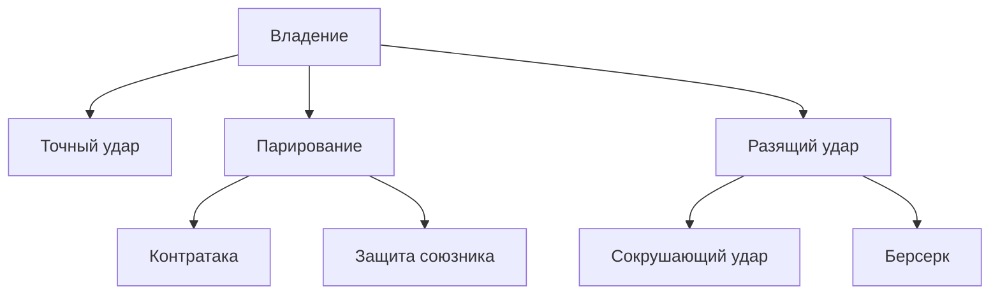

#### Броня

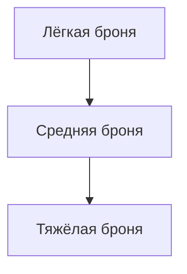

#### Дальний бой (пробивание)

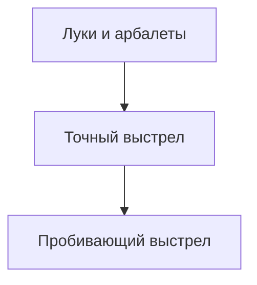

#### Скрытность и обман

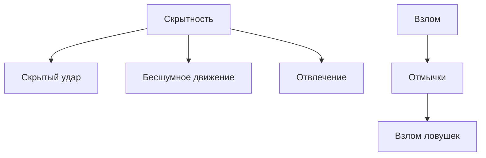

#### Знания

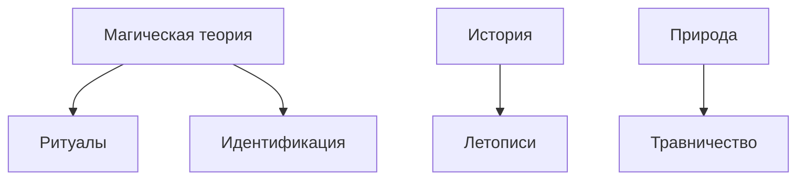

#### Социальные

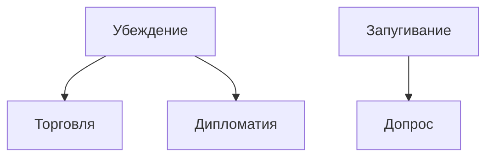

#### Таланты — Тактика

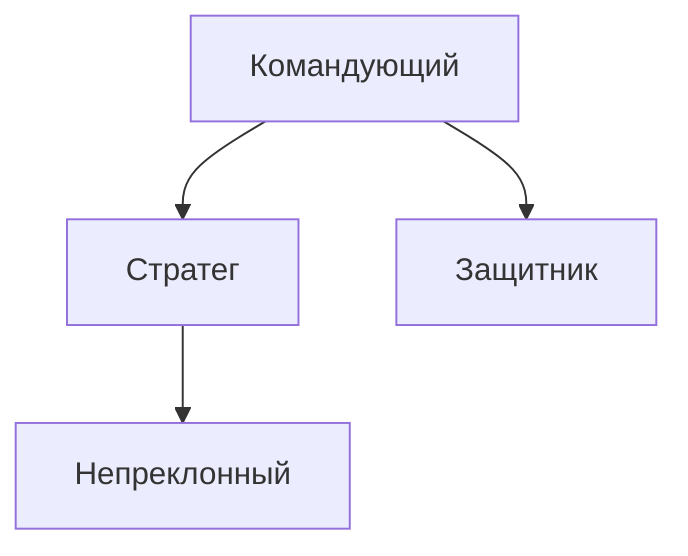

#### Таланты — Мастер клинка

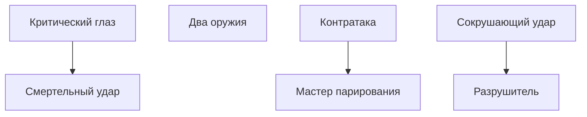

#### Таланты — Тень

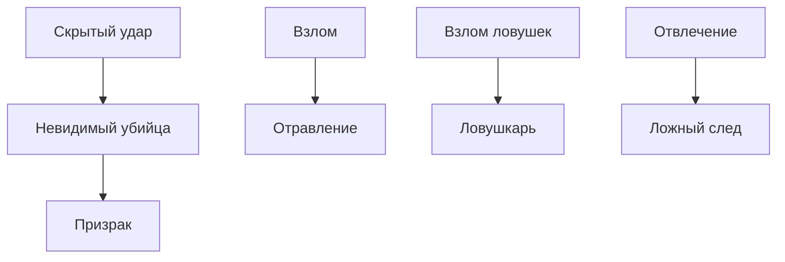

#### Таланты — Магическое мастерство

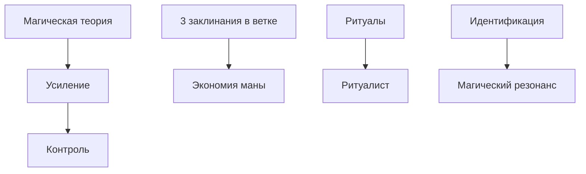

#### Таланты — Выносливость

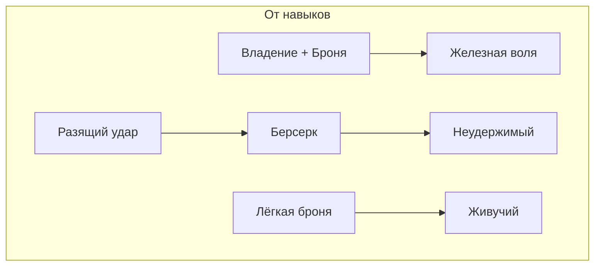

#### Таланты — Снайпер

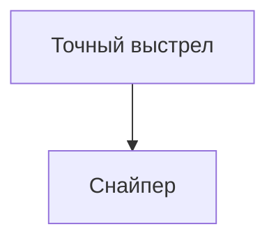

---

## МОДУЛЬ: Заклинания

Заклинания изучаются **по древовидной структуре** — чтобы выучить заклинание, нужно знать хотя бы одно из родительских в цепочке.

### Очки маны (ОМ)

**Базовое ОМ:** Разум × 2 + уровень × 3

Восстановление: все ОМ за длительный отдых, половина за короткий.

### Изучение заклинаний

- При повышении уровня — **2 очка магии** (если есть доступ к магии)
- **Корневое** заклинание ветки изучается без требований
- Для изучения следующего — нужно знать **все родительские** (соединённые стрелкой выше)
- Некоторые заклинания требуют **уровень персонажа**
- **Максимум рангов заклинания:** 3

**Одно очко магии** = новое заклинание **или** +1 ранг к известному. Ограничения:
- **2 очка** = два новых заклинания, или два повышения ранга (разным заклинаниям), или одно новое + одно повышение ранга
- **Ранг** нельзя повышать дважды за уровень у одного и того же заклинания
- **Ранг** нельзя повышать у заклинания, только что изученного на этом уровне

### Проверка заклинания

**2d6 + Разум + Навык школы магии** против СЛ. СЛ зависит от круга и сложности заклинания (обычно 10–22).

### Огненная магия

| Заклинание | ОМ | Ур. | Требование | Описание |
|------------|-----|-----|------------|----------|
| Искра | 1 | 1 | — | 1d4 урона огнём, дистанция 10 м |
| Огненная стрела | 2 | 1 | Искра | 2d6 урона, дистанция 20 м |
| Огненный факел | 1 | 1 | Искра | Свет 10 м, поджигает горючее |
| Огненный шар | 4 | 3 | Огненная стрела | 4d6 урона по области 3 м |
| Пламенный щит | 3 | 2 | Огненный факел | Сопротивление огню 3, урон при касании 1d4 |
| Огненная стена | 6 | 5 | Огненный шар | Стена 6 м, 4d6 урона при прохождении |
| Метеоритный дождь | 8 | 7 | Огненный шар | 6d6 урона по области 6 м, несколько целей |
| Огненный след | 4 | 3 | Пламенный щит | Линия огня 6 м, 2d6 урона при прохождении |

### Ледяная магия

| Заклинание | ОМ | Ур. | Требование | Описание |
|------------|-----|-----|------------|----------|
| Ледяной осколок | 1 | 1 | — | 1d4 урона холодом, дистанция 10 м |
| Ледяная стрела | 2 | 1 | Ледяной осколок | 2d6 урона, замедление на 1 раунд |
| Ледяное касание | 1 | 1 | Ледяной осколок | Замедление цели на 1 раунд |
| Ледяная сфера | 4 | 3 | Ледяная стрела | 4d6 урона по области 3 м |
| Ледяная броня | 3 | 2 | Ледяное касание | +2 ОС себе на 3 раунда |
| Ледяная стена | 6 | 5 | Ледяная сфера | Стена 6 м, блокирует проход |
| Ледяная буря | 8 | 7 | Ледяная сфера | 6d6 урона по области 6 м, сильное замедление |
| Ледяной панцирь | 5 | 4 | Ледяная броня | Сопротивление холоду 3, +1 ОС на 5 раундов |

### Светлая магия (исцеление)

| Заклинание | ОМ | Ур. | Требование | Описание |
|------------|-----|-----|------------|----------|
| Лечение ран | 1 | 1 | — | 1d6 + Разум восстановления ПЗ |
| Исцеление | 3 | 1 | Лечение ран | 2d8 + Разум восстановления ПЗ |
| Благословение | 2 | 1 | Лечение ран | +1 к атакам союзника на 3 раунда |
| Массовое исцеление | 5 | 4 | Исцеление | 2d6 + Разум для всех союзников в зоне |
| Священный свет | 4 | 3 | Исцеление | 3d6 урона нежити по области 3 м |
| Аура защиты | 4 | 3 | Благословение | +1 ОС всем союзникам в зоне на 3 раунда |
| Воскрешение | 8 | 6 | Массовое исцеление | Вернуть к жизни (если смерть < 1 минуты) |
| Изгнание нежити | 5 | 4 | Священный свет | Отогнать нежить (проверка ВОЛЯ) |

### Тёмная магия

| Заклинание | ОМ | Ур. | Требование | Описание |
|------------|-----|-----|------------|----------|
| Тёмное касание | 1 | 1 | — | 1d4 урона тьмой, дистанция касания |
| Вытягивание жизни | 3 | 2 | Тёмное касание | 2d6 урона, половина — в ПЗ |
| Страх | 2 | 1 | Тёмное касание | Цель должна пройти проверку ВОЛЯ или отступить |
| Проклятие | 4 | 4 | Вытягивание жизни | −2 к атакам и проверкам цели |
| Круг смерти | 6 | 6 | Вытягивание жизни | 4d6 урона по области 4 м |
| Массовый страх | 4 | 3 | Страх | Страх по области 3 м |
| Паралич | 5 | 4 | Страх | Одна цель: проверка ВОЛЯ или пропуск хода |

### Магия защиты

| Заклинание | ОМ | Ур. | Требование | Описание |
|------------|-----|-----|------------|----------|
| Щит | 1 | 1 | — | +4 ОС до следующего хода |
| Барьер | 3 | 2 | Щит | +2 ОС союзнику на 3 раунда |
| Магический щит | 2 | 1 | Щит | +2 ОС себе на 2 раунда |
| Магический доспех | 4 | 4 | Барьер | +4 ОС цели на 10 минут |
| Отражение | 4 | 3 | Барьер | Следующая атака по цели отражается на атакующего |
| Непробиваемый щит | 6 | 6 | Магический щит | Иммунитет к урону 1 раунд |
| Щитовой удар | 5 | 4 | Магический щит | При блоке — 1d6 урона атакующему |

### Магия призыва

| Заклинание | ОМ | Ур. | Требование | Описание |
|------------|-----|-----|------------|----------|
| Призрак-помощник | 2 | 1 | — | Дух выполняет 1 простое действие |
| Призыв волка | 4 | 3 | Призрак-помощник | Волк сражается 3 раунда |
| Призыв духа | 3 | 2 | Призрак-помощник | Дух разведки, передаёт информацию |
| Призыв элементаля | 6 | 5 | Призыв волка | Элементаль сражается 5 раундов |
| Призыв стаи | 5 | 4 | Призыв волка | 3 волка на 2 раунда |
| Призыв демона | 8 | 7 | Призыв элементаля | Мощное существо, 3 раунда |
| Призрачный разведчик | 4 | 3 | Призыв духа | Невидимый разведчик на 10 минут |

### Магия иллюзий

| Заклинание | ОМ | Ур. | Требование | Описание |
|------------|-----|-----|------------|----------|
| Иллюзорный звук | 1 | 1 | — | Создать звук |
| Невидимость | 3 | 2 | Иллюзорный звук | Скрыть 1 цель на 3 раунда |
| Иллюзорный образ | 2 | 1 | Иллюзорный звук | Статичный образ (обман зрения) |
| Массовая невидимость | 5 | 4 | Невидимость | Скрыть группу на 2 раунда |
| Маскировка | 6 | 5 | Невидимость | Принять облик другого существа |
| Фантомный двойник | 4 | 3 | Иллюзорный образ | Копия отвлекает, 50% шанс переключить атаку |
| Массовая иллюзия | 6 | 5 | Иллюзорный образ | Иллюзия группы существ |

### Концентрация

Некоторые заклинания требуют концентрации — заклинатель не может поддерживать более одного такого заклинания. При получении урона — проверка Разум (СЛ = половина полученного урона).

### Ритуалы

Заклинания, не требующие ОМ, но занимающие время (10+ минут). Примеры: Определение магии, Очищение воды, Защита от зла.

### Провал заклинания

При провале проверки: ОМ тратится, заклинание не срабатывает. Критический провал: откат (урон себе = половина ОМ заклинания в ПЗ) или неконтролируемый эффект на усмотрение Мастера.

### Влияние ранга на заклинания

При повышении ранга заклинания усиливается один из параметров. Базовые значения — ранг 1.

#### Огненная магия

| Заклинание | Ранг 1 | Ранг 2 | Ранг 3 |
|------------|--------|--------|--------|
| Искра | 1d4 урона, 10 м | 1d6 урона, 15 м | 2d4 урона, 20 м |
| Огненная стрела | 2d6, 20 м | 3d6, 25 м | 4d6, 30 м |
| Огненный факел | Свет 10 м | Свет 15 м | Свет 20 м |
| Огненный шар | 4d6, область 3 м | 5d6, область 4 м | 6d6, область 5 м |
| Пламенный щит | Сопр. огню 3, 1d4 при касании | Сопр. 4, 1d6 при касании | Сопр. 5, 2d4 при касании |
| Огненная стена | 6 м, 4d6 | 8 м, 5d6 | 10 м, 6d6 |
| Метеоритный дождь | 6d6, область 6 м | 8d6, область 7 м | 10d6, область 8 м |
| Огненный след | 6 м, 2d6 | 8 м, 3d6 | 10 м, 4d6 |

#### Ледяная магия

| Заклинание | Ранг 1 | Ранг 2 | Ранг 3 |
|------------|--------|--------|--------|
| Ледяной осколок | 1d4, 10 м | 1d6, 15 м | 2d4, 20 м |
| Ледяная стрела | 2d6, замедл. 1 раунд | 3d6, замедл. 2 раунда | 4d6, замедл. 3 раунда |
| Ледяное касание | Замедл. 1 раунд | Замедл. 2 раунда | Замедл. 3 раунда |
| Ледяная сфера | 4d6, область 3 м | 5d6, область 4 м | 6d6, область 5 м |
| Ледяная броня | +2 ОС, 3 раунда | +3 ОС, 4 раунда | +4 ОС, 5 раундов |
| Ледяная стена | 6 м, ПЗ 20 | 8 м, ПЗ 25 | 10 м, ПЗ 30 |
| Ледяная буря | 6d6, область 6 м | 8d6, область 7 м | 10d6, область 8 м |
| Ледяной панцирь | Сопр. холоду 3, +1 ОС, 5 раундов | Сопр. 4, +2 ОС, 6 раундов | Сопр. 5, +3 ОС, 7 раундов |

#### Светлая магия

| Заклинание | Ранг 1 | Ранг 2 | Ранг 3 |
|------------|--------|--------|--------|
| Лечение ран | 1d6 + Разум | 2d6 + Разум | 3d6 + Разум |
| Исцеление | 2d8 + Разум | 3d8 + Разум | 4d8 + Разум |
| Благословение | +1 к атакам, 3 раунда | +2 к атакам, 4 раунда | +3 к атакам, 5 раундов |
| Массовое исцеление | 2d6 + Разум, зона 3 м | 3d6 + Разум, зона 4 м | 4d6 + Разум, зона 5 м |
| Священный свет | 3d6 урона нежити, 3 м | 4d6, 4 м | 5d6, 5 м |
| Аура защиты | +1 ОС союзникам, 3 раунда | +2 ОС, 4 раунда | +3 ОС, 5 раундов |
| Воскрешение | 1 ПЗ при воскрешении | 5 ПЗ при воскрешении | 10 ПЗ при воскрешении |
| Изгнание нежити | СЛ 14, зона 5 м | СЛ 16, зона 6 м | СЛ 18, зона 8 м |

#### Тёмная магия

| Заклинание | Ранг 1 | Ранг 2 | Ранг 3 |
|------------|--------|--------|--------|
| Тёмное касание | 1d4, касание | 1d6, касание | 2d4, касание |
| Вытягивание жизни | 2d6, ½ в ПЗ | 3d6, ½ в ПЗ | 4d6, ½ в ПЗ |
| Страх | СЛ 12, 1 раунд | СЛ 14, 2 раунда | СЛ 16, 3 раунда |
| Проклятие | −2 к атакам и проверкам | −3 к атакам и проверкам | −4 к атакам и проверкам |
| Круг смерти | 4d6, область 4 м | 5d6, область 5 м | 6d6, область 6 м |
| Массовый страх | СЛ 12, 3 м | СЛ 14, 4 м | СЛ 16, 5 м |
| Паралич | СЛ 16, 1 раунд | СЛ 18, 2 раунда | СЛ 20, 3 раунда |

#### Магия защиты

| Заклинание | Ранг 1 | Ранг 2 | Ранг 3 |
|------------|--------|--------|--------|
| Щит | +4 ОС до след. хода | +5 ОС | +6 ОС |
| Барьер | +2 ОС союзнику, 3 раунда | +3 ОС, 4 раунда | +4 ОС, 5 раундов |
| Магический щит | +2 ОС себе, 2 раунда | +3 ОС, 3 раунда | +4 ОС, 4 раунда |
| Магический доспех | +4 ОС, 10 мин | +5 ОС, 15 мин | +6 ОС, 20 мин |
| Отражение | 1 атака отражается | 2 атаки отражаются | 3 атаки отражаются |
| Непробиваемый щит | Иммунитет 1 раунд | Иммунитет 2 раунда | Иммунитет 3 раунда |
| Щитовой удар | 1d6 урона при блоке | 2d6 при блоке | 3d6 при блоке |

#### Магия призыва

| Заклинание | Ранг 1 | Ранг 2 | Ранг 3 |
|------------|--------|--------|--------|
| Призрак-помощник | 1 действие, 20 м | 2 действия, 30 м | 3 действия, 40 м |
| Призыв волка | 3 раунда | 4 раунда, +1d6 урона волку | 5 раундов, +2d6 урона волку |
| Призыв духа | 10 мин, 100 м | 15 мин, 150 м | 20 мин, 200 м |
| Призыв элементаля | 5 раундов, ПЗ 40–50 | 6 раундов, ПЗ 50–60 | 7 раундов, ПЗ 60–70 |
| Призыв стаи | 3 волка, 2 раунда | 4 волка, 3 раунда | 5 волков, 4 раунда |
| Призыв демона | 3 раунда, ПЗ 60+ | 4 раунда, ПЗ 70+ | 5 раундов, ПЗ 80+ |
| Призрачный разведчик | 10 мин, 30 см | 15 мин, 50 см | 20 мин, 1 м |

#### Магия иллюзий

| Заклинание | Ранг 1 | Ранг 2 | Ранг 3 |
|------------|--------|--------|--------|
| Иллюзорный звук | 1 звук, 20 м | 2 звука, 30 м | 3 звука, 40 м |
| Невидимость | 3 раунда | 4 раунда | 5 раундов |
| Иллюзорный образ | 2 м, 5 мин | 3 м, 10 мин | 4 м, 15 мин |
| Массовая невидимость | 2 раунда, зона 3 м | 3 раунда, зона 4 м | 4 раунда, зона 5 м |
| Маскировка | 30 мин, СЛ 16 | 1 час, СЛ 18 | 2 часа, СЛ 20 |
| Фантомный двойник | 50% шанс переключить атаку | 60% шанс | 70% шанс |
| Массовая иллюзия | 10 существ, 6×6 м | 15 существ, 8×8 м | 20 существ, 10×10 м |

*Стоимость ОМ не меняется при повышении ранга.*

### Деревья заклинаний

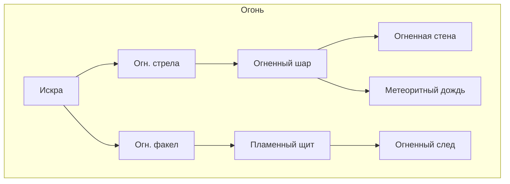

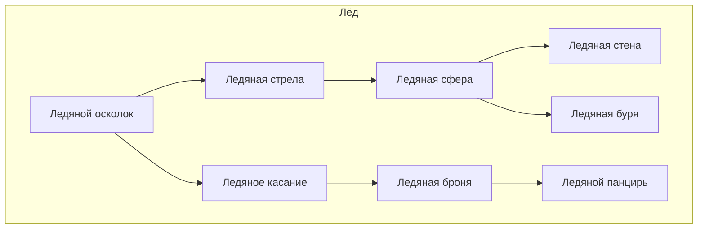

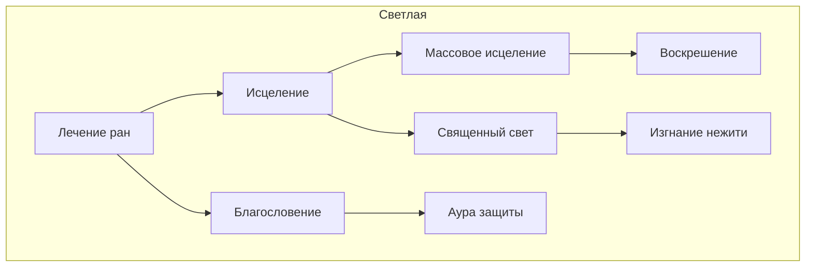

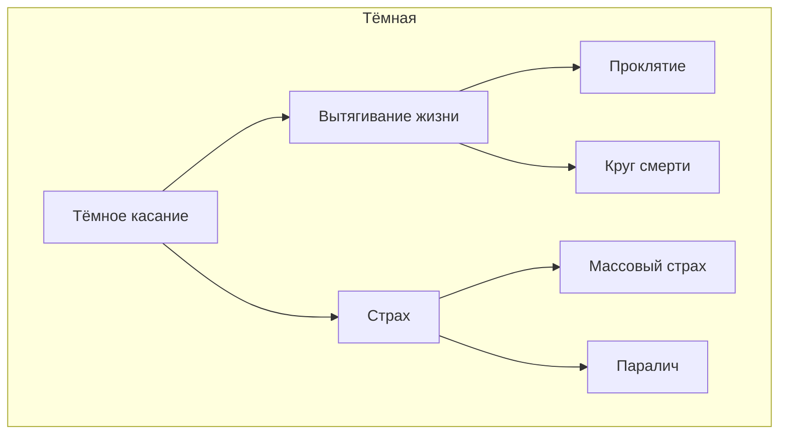

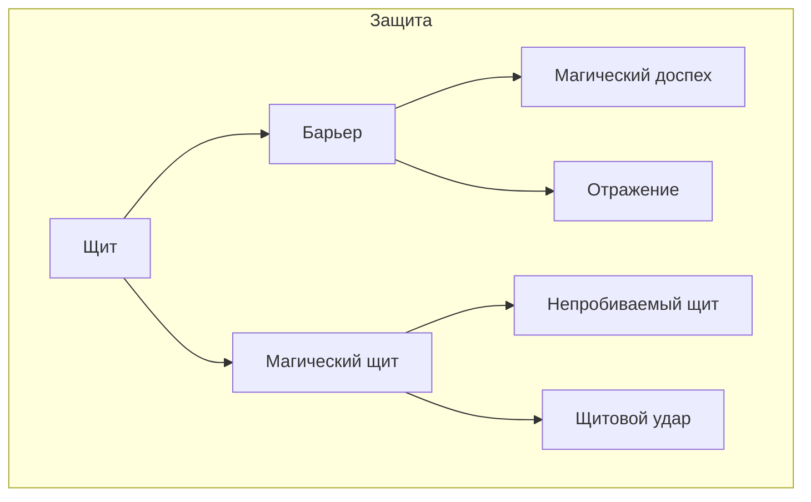

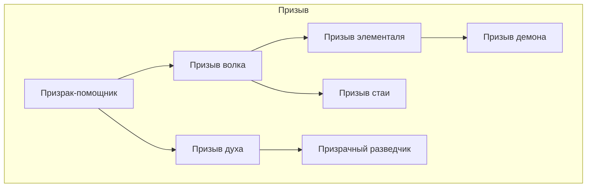

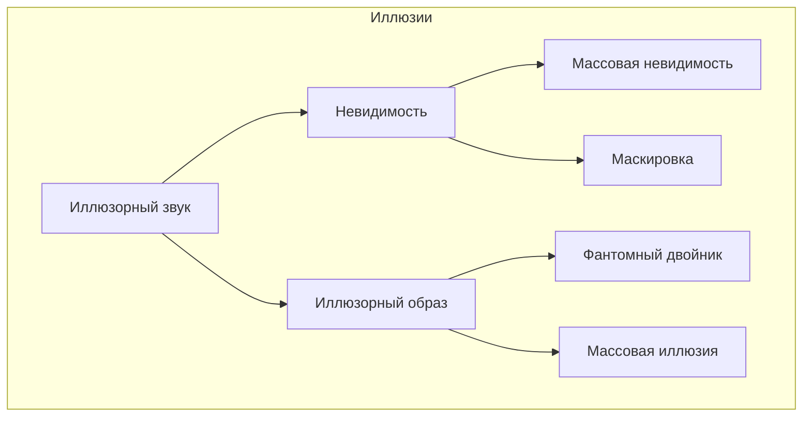

---

## МОДУЛЬ: Оружие (фэнтези)

### Ближний бой

| Оружие | Урон | СКА | ОС игнор. | Особенности |
|--------|------|-----|-----------|-------------|
| Кинжал | 1d4 | 3 | — | Лёгкое, скрытое |
| Короткий меч | 1d6 | 3 | — | Лёгкое |
| Меч | 1d8 | 2 | — | — |
| Длинный меч | 1d8 | 2 | — | Универсальное |
| Топор | 1d8 | 2 | — | — |
| Боевой топор | 1d10 | 1 | — | Двуручное |
| Копьё | 1d6 | 2 | — | Древковое, можно метать |
| Алебарда | 1d10 | 1 | — | Древковое, двуручное |
| Булава | 1d6 | 2 | 1 | Игнорирует 1 ОС |
| Молот | 1d8 | 2 | — | — |
| Посох | 1d4 | 3 | — | Двуручное, фокус для магии |
| Коса | 1d8 | 1 | — | Древковое, двуручное |

### Дальний бой

| Оружие | Урон | СКА | Дистанция | Особенности |
|--------|------|-----|-----------|-------------|
| Короткий лук | 1d6 | 2 | 20/40 м | — |
| Длинный лук | 1d8 | 2 | 30/60 м | — |
| Арбалет | 1d10 | 1 | 30/90 м | Перезарядка 1 раунд |
| Метательный нож | 1d4 | 3 | 6/12 м | — |
| Метательное копьё | 1d6 | 2 | 10/20 м | — |
| Праща | 1d4 | 2 | 15/30 м | — |

### Фэнтезийное оружие

| Оружие | Урон | СКА | Особенности |
|--------|------|-----|-------------|
| Эльфийский клинок | 1d8 | 3 | +1 к попаданию, лёгкий |
| Дварфский боевой топор | 1d10 | 2 | Игнорирует 2 ОС |
| Посох мага | 1d4 | 3 | −1 ОМ на заклинания, фокус |
| Серебряный меч | 1d8 | 2 | Урон по нежити ×1.5 |
| Кинжал теней | 1d4 | 4 | +2 к скрытой атаке |

---

## МОДУЛЬ: Броня (фэнтези)

### Таблица брони

| Тип | ОС | Штраф | Требование |
|-----|-----|-------|------------|
| Нет | 0 | — | — |
| Ткань/рубаха | 0 | — | — |
| Кожаная | 10 | — | — |
| Усиленная кожа | 11 | — | Лёгкая броня |
| Кольчуга | 13 | −1 Скорость | Средняя броня |
| Чешуйчатая | 14 | −1 Скорость | Средняя броня |
| Латы (частичные) | 15 | −2 Скорость | Тяжёлая броня |
| Полные латы | 16 | −2 Скорость | Тяжёлая броня |
| Щит (доп.) | +2 ОС | — | — |

### Фэнтезийная броня

| Тип | ОС | Особенности |
|-----|-----|-------------|
| Эльфийская кожа | 12 | Нет штрафа к Скорости |
| Дварфская кольчуга | 14 | Сопротивление огню 1 |
| Драконья чешуя | 18 | Сопротивление выбранной стихии 3 |
| Кожа тёмного эльфа | 11 | +2 к скрытности в темноте |
| Магический плащ | +1 ОС | Накладывается на броню, 1 слот |

### Щиты

| Щит | Бонус ОС | Особенности |
|-----|----------|-------------|
| Маленький | +1 | Можно использовать второе оружие |
| Средний | +2 | — |
| Большой | +3 | −1 к атаке |
| Башенный | +4 | −2 к атаке, двуручный |

---

## МОДУЛЬ: Пробивание брони

*Решает проблему слабого урона в дальнем бою: при полной ОС цели лук 1d8 против кольчуги (ОС 13) почти всегда наносит лишь 1 ПЗ. Модуль добавляет механики пробивания.*

### Механика ПБ (Пробивание брони)

**ПБ** снижает эффективную ОС цели при расчёте урона.

| Тип атаки | Формула урона |
|-----------|---------------|
| **Ближний бой** | `Урон = Бросок − ((ОС − ПБ) ÷ 2)` |
| **Дальний бой** | `Урон = Бросок − (ОС − ПБ)` |
| **Заклинание (атака)** | `Урон = Бросок − (ОС − ПБ)` |

Эффективная ОС не может быть меньше 0. Минимальный урон — 1 ПЗ.

**Пример:** Лук 1d8, цель в кольчуге (ОС 13). Без ПБ: 8 − 13 = 0 → 1 ПЗ. С ПБ 5: эффективная ОС = 13 − 5 = 8; 8 − 8 = 0 → 1 ПЗ. С ПБ 5 и броском 10: 10 − 8 = **2 ПЗ**.

### Источники ПБ

| Источник | ПБ | Примечание |
|----------|-----|------------|
| **Навык «Точный выстрел»** | +3 | Только дальний бой. ПБ фиксирован, не зависит от ранга |
| **Навык «Пробивающий выстрел»** | +5 | Заменяет Точный выстрел. ПБ фиксирован, не зависит от ранга |
| **Талант «Снайпер»** | — | Дальний бой игнорирует половину ОС (как ближний) |
| **Бронебойные стрелы** | +3 | Расходуются, 5 за слот |
| **Бронебойные болты** | +4 | Для арбалета, 5 за слот |
| **Тяжёлый арбалет** | +2 | Встроенный ПБ, СКА 1 |

### Боеприпасы с ПБ

| Боеприпас | ПБ | Цена | Особенности |
|-----------|-----|------|-------------|
| Обычные стрелы/болты | 0 | — | — |
| Бронебойные стрелы | +3 | ×2 | 5 шт. за слот |
| Бронебойные болты | +4 | ×2 | 5 шт. за слот |
| Игольчатые стрелы | +2 | ×1.5 | Меньший урон (1d6 вместо 1d8), но +2 ПБ |

### Оружие с встроенным ПБ

| Оружие | Урон | СКА | ПБ | Особенности |
|--------|------|-----|-----|-------------|
| Тяжёлый арбалет | 1d10 | 1 | 2 | Перезарядка 1 раунд |
| Бронебойный арбалет | 1d8 | 1 | 3 | Редкое, перезарядка 1 раунд |
| Адаптивный лук | 1d8 | 2 | 1 | Магический, +1 ПБ за 1 ОМ |

### Заклинания и ПБ

Атакующие заклинания (Искра, Огненная стрела и т.д.) по умолчанию не имеют ПБ. Мастер может дать заклинаниям ПБ по школе:
- **Огненные** — ПБ 2 (прожигает броню)
- **Ледяные** — ПБ 1
- **Священный свет** — ПБ 4 против нежити

---

## МОДУЛЬ: Товары и лавки

Модуль для торговли, цен и типов лавок в фэнтези-сеттинге.

### Денежная единица

**Монета** (м.) — базовая единица. 1 золотая = 10 серебряных = 100 медных. В таблицах цены в серебре, если не указано иное.

### Стартовые деньги

При создании персонажа: **половина стоимости полного комплекта** по профессии (см. примеры ниже) или **30 монет** по умолчанию.

### Товары — оружие

| Товар | Цена | Примечание |
|-------|------|------------|
| Кинжал | 3 м. | 1d4, СКА 3 |
| Короткий меч | 5 м. | 1d6, СКА 3 |
| Меч | 8 м. | 1d8, СКА 2 |
| Длинный меч | 10 м. | 1d8, СКА 2 |
| Топор | 7 м. | 1d8, СКА 2 |
| Боевой топор | 12 м. | 1d10, СКА 1 |
| Копьё | 4 м. | 1d6, СКА 2 |
| Булава | 6 м. | 1d6, СКА 2, игнор. 1 ОС |
| Короткий лук | 8 м. | 1d6, СКА 2 |
| Длинный лук | 15 м. | 1d8, СКА 2 |
| Арбалет | 25 м. | 1d10, СКА 1 |
| Стрелы (20) | 2 м. | Расходуются |
| Болты (10) | 3 м. | Для арбалета |
| Бронебойные стрелы (5) | 4 м. | +3 ПБ |

### Товары — броня

| Товар | Цена | ОС |
|-------|------|-----|
| Ткань/рубаха | 1 м. | 0 |
| Кожаная | 5 м. | 10 |
| Усиленная кожа | 8 м. | 11 |
| Кольчуга | 40 м. | 13 |
| Чешуйчатая | 55 м. | 14 |
| Латы (частичные) | 80 м. | 15 |
| Полные латы | 120 м. | 16 |
| Щит малый | 5 м. | +1 ОС |
| Щит средний | 10 м. | +2 ОС |
| Щит большой | 15 м. | +3 ОС |

### Товары — расходники и прочее

| Товар | Цена | Эффект |
|-------|------|--------|
| Аптечка | 5 м. | 1d6+2 ПЗ, 1 раунд |
| Зелье лечения | 25 м. | 2d8+4 ПЗ |
| Антидот | 15 м. | Снять отравление |
| Факел | 1 м. | Свет 12 м, 1 час |
| Верёвка (15 м) | 2 м. | Лазание, связывание |
| Набор отмычек | 3 м. | +1 к взлому |
| Рюкзак | 2 м. | — |
| Рацион (1 день) | 1 м. | Еда и вода |

### Типы лавок

| Лавка | Ассортимент | Модификатор цены |
|-------|-------------|------------------|
| **Деревенская** | Оружие до 10 м., кожа, базовые расходники | +20% |
| **Городская** | Всё оружие и броня до 50 м., зелья | Базовая |
| **Оружейная** | Оружие, броня, боеприпасы | −10% на оружие |
| **Алхимическая** | Зелья, расходники, редко — магические предметы | +10% на зелья |
| **Чёрный рынок** | Всё, включая запрещённое | +30%, проверка СЛ |
| **Гильдия** | Специализированный товар по профессии | −15% для членов |

### Торг

**Проверка:** 2d6 + Характер + Навык «Торговля» против СЛ.

| СЛ | Ситуация |
|----|-----------|
| 10 | Обычная лавка, нейтральный торговец |
| 12 | Торговец спешит или недоволен |
| 14 | Редкий товар, мало предложений |
| 16 | Враждебный торговец, осада, дефицит |

**Успех:** скидка 10–20% (на усмотрение мастера). **Критический успех:** скидка 25% или редкий товар в наличии.

### Комплекты по профессии

| Профессия | Полный комплект | Стартовые деньги |
|-----------|-----------------|------------------|
| Воин | Меч, кольчуга, щит, факел, рюкзак (~60 м.) | 30 м. |
| Охотник | Лук, стрелы, кожа, кинжал, рюкзак (~27 м.) | 15 м. |
| Маг | Посох, кожа, рюкзак, компоненты (~50 м.) | 25 м. |
| Жрец | Булава, кольчуга, символ, рюкзак (~55 м.) | 28 м. |
| Плут | 2 кинжала, кожа, отмычки, рюкзак (~20 м.) | 10 м. |
